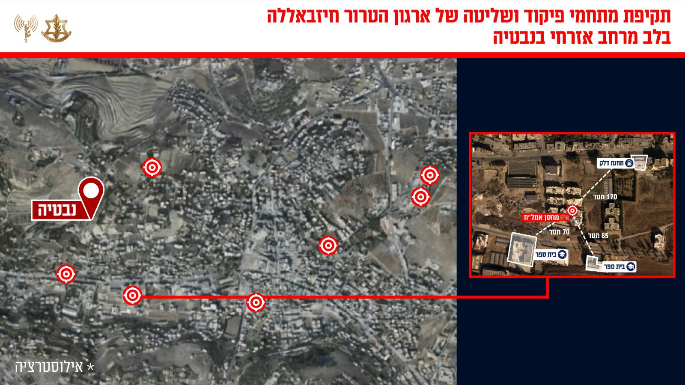

## Message 13522

דובר צה"ל:

צה"ל תקף מתחמי פיקוד ושליטה של ארגון הטרור חיזבאללה בנבטיה המשמשים לקידום מתווי טרור

מטוסי קרב של חיל האוויר, בהכוונת פיקוד הצפון, תקפו במהלך היום ברחבי נבטיה שבדרום לבנון מתחמי פיקוד ושליטה ומחסני אמצעי לחימה של ארגון הטרור חיזבאללה.

ארגון הטרור חיזבאללה משתלט באופן שיטתי על מרחבים אזרחיים ברחבי מדינת לבנון, על מנת לבצע פעולות ומתווי טרור, תוך הטמעת פעיליו ומפקדיו במרחב האזרחי. פעילות זו פוגעת ומסכנת את אזרחי מדינת לבנון.

טרם התקיפה ננקטו צעדים רבים על מנת לצמצם את הסיכוי לפגיעה באזרחים, הכוללים אזהרות רבות בפלטפורמות שונות לאוכלוסייה באזור.

תקיפות אלו מהוות חלק נוסף במאמץ המתמשך של צה"ל לפגוע בפעילות הצבאית של ארגון הטרור חיזבאללה ולהקשות על הארגון לשקם את יכולותיו הצבאיות.

