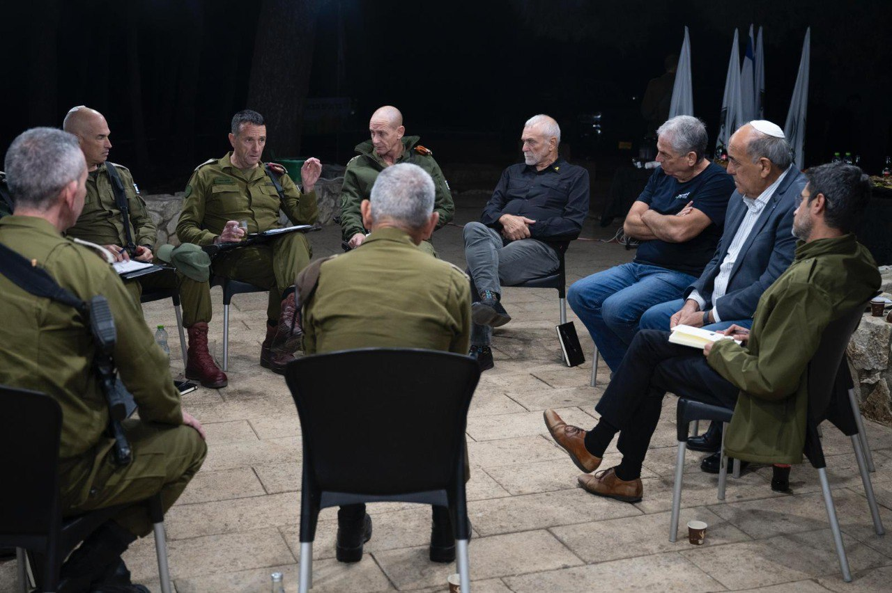

## Message 13561

דובר צה"ל:

הרמטכ"ל לראשי הרשויות בצפון: "אין דבר שמסמל ניצחון יותר מחזרה בטוחה של התושבים, ונעשה את הדרך הזו ביחד. בכל הסדר מדיני באם יהיה, צה"ל יצטרך לאכוף הפרות באש" 

הרמטכ״ל, רב-אלוף הרצי הלוי, מפקד פיקוד הצפון, מפקד פיקוד העורף וראש אגף התכנון נפגשו היום (ה') עם ראשי הרשויות והמועצות בצפון מקרית שמונה, גליל עליון, מבואות חרמון, מעלה יוסף ושלומי. 

מדבריו של ראש המטה הכללי, רב-אלוף הרצי הלוי: ״אין דבר שמסמל ניצחון יותר מחזרה בטוחה של התושבים, ונעשה את הדרך הזו ביחד. אנחנו פוגעים בתשתיות שחיזבאללה בנה משנת 2006, הולכים על זה הכי חזק שאפשר ולא ניתן לזה לקום. זה לא נגמר בזה, אנחנו ממשיכים עם הרבה נחישות וכוח. אני פוגש את הכוחות הפועלים בשטח, מלאי גאווה להילחם למען המטרה הנעלה של החזרת תושבים בביטחון. אנחנו צריכים להכין תוכניות מסודרות ולהבטיח שיהיה פה טוב יותר טוב ממה שהיה לפני המלחמה. יש לנו את הזכות להגן על עצמנו, ובכל הסדר מדיני באם יהיה, צה"ל יצטרך לאכוף הפרות באש. לאורך כל המלחמה, רמת התיאום ושיתוף הפעולה בין צה"ל לרשויות המקומיות והערים הם מהטובים שאי פעם ידענו״.

