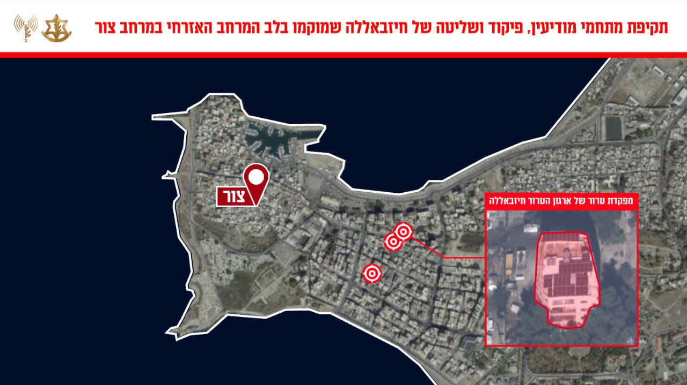

## Message 13579

דובר צה״ל:

צה"ל תקף מתחמי מודיעין, פיקוד ושליטה בהם פעלו מחבלים מארגון הטרור ׳חיזבאללה׳ בעיר צור בדרום לבנון

מטוסי קרב של חיל האוויר תקפו הערב, בהכוונה מודיעינית של אגף המודיעין ופיקוד הצפון מפקדות של ארגון הטרור חיזבאללה מהם פעלו מפקדי ומחבלי חיזבאללה בלב המרחב האזרחי סמוך לעיר צור שבדרום לבנון.

ארגון הטרור חיזבאללה משתלט באופן שיטתי על מרחבים אזרחיים ברחבי מדינת לבנון ומנצל תשתיות אזרחיות למטרות טרור, תוך הטמעת פעיליו ומפקדיו במרחב האזרחי. פעילות זו פוגעת ומסכנת את אזרחי מדינת לבנון.

במהלך היממה האחרונה, כוחות צה״ל חיסלו עשרות מחבלים בדרום לבנון. בסגירת מעגל, כלי טיס של חיל האוויר תקפו את המשגרים מהם זוהו השיגורים שחצו לעבר עכו ואחיהוד מוקדם יותר היום.
כמו כן, הותקפו מחסני אמצעי לחימה ומבנים צבאיים רבים בדרום לבנון.

תקיפות אלו מהוות חלק נוסף במאמץ של צה״ל לפגוע בפעילות הצבאית של ארגון הטרור חיזבאללה ולהקשות על הארגון לשקם את יכולותיו הצבאיות.

