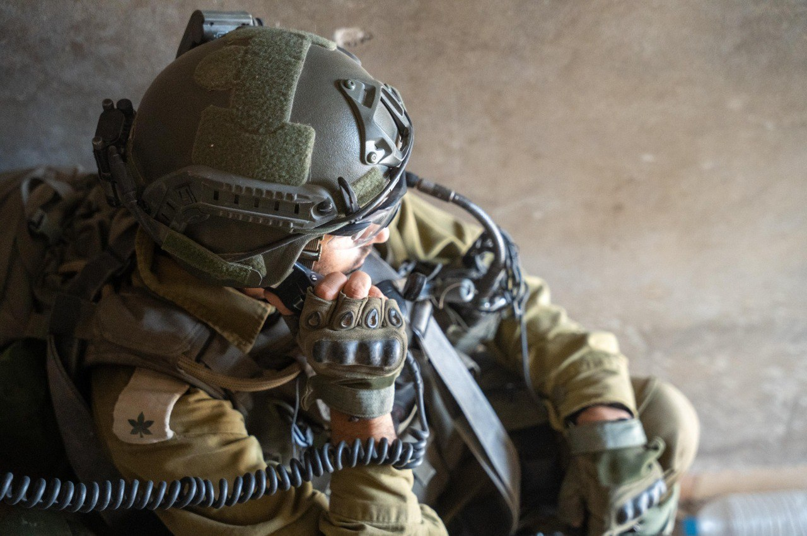

## Message 13585

דובר צה״ל:

חיל האוויר תקף יותר מ-50 מטרות טרור ברצועת עזה ובלבנון: עשרות מחבלים חוסלו ואמצעי לחימה רבים אותו והושמדו

אוגדה 162 ממשיכה לפעול במרחב ג'באליה, במהלך היממה האחרונה הכוחות חיסלו עשרות מחבלים. בנוסף, הכוחות איתרו והשמידו מחסן אמצעי לחימה. 
לוחמי צוות הקרב של חטיבת הנח״ל ממשיכים להילחם ברפיח בפיקוד אוגדת עזה (143), הכוחות חיסלו מחבלים, איתרו אמצעי לחימה והשמידו תשתיות טרור.

במהלך היממה האחרונה, חיל האוויר תקף יותר מ-50 מטרות טרור בלבנון וברצועת עזה, בלבנון חלק מהמטרות הותקפו בהכוונת פיקוד הצפון, בין המטרות שהותקפו: מבנים צבאיים, מחסני אמצעי לחימה ומשגרים.

