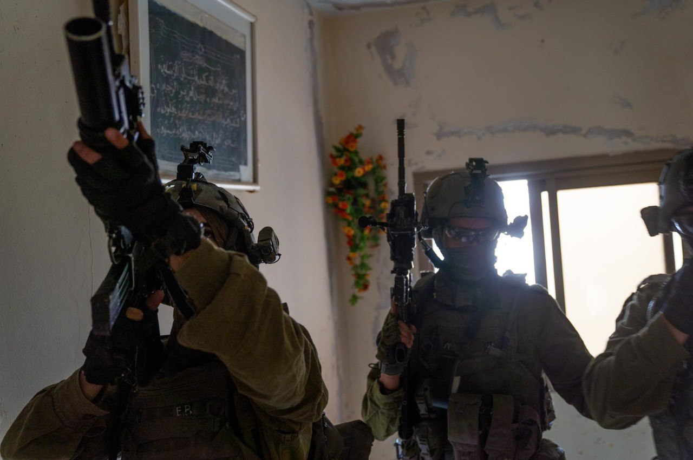

## Message 13604

דובר צה"ל:

חיסול מחבל בחילופי אש, מעצרים והחרמת אמצעי לחימה; הסתיים מבצע באור יום בעקבה שבחטיבת הבקעה והעמקים 

מוקדם יותר היום, הושלם מבצע לסיכול טרור במרחב עקבה שבחטיבת הבקעה והעמקים, בהם פעלו לאור יום לוחמי דובדבן במילואים, יחידת מגלן, לוחמי 636 וכוחות נוספים בהכוונה מודיעינית של שב״כ.

במהלך המבצע הכוחות חיסלו מחבל שפתח בירי לעברם, עצרו מבוקש ותחקרו חשודים.
כמו כן, איתרו והחרימו נשקים מסוג ׳קרלו׳, תחמושת וציוד לחימה.

החשודים ואמצעי הלחימה הועברו לטיפול כוחות הביטחון. אין נפגעים לכוחותינו.

