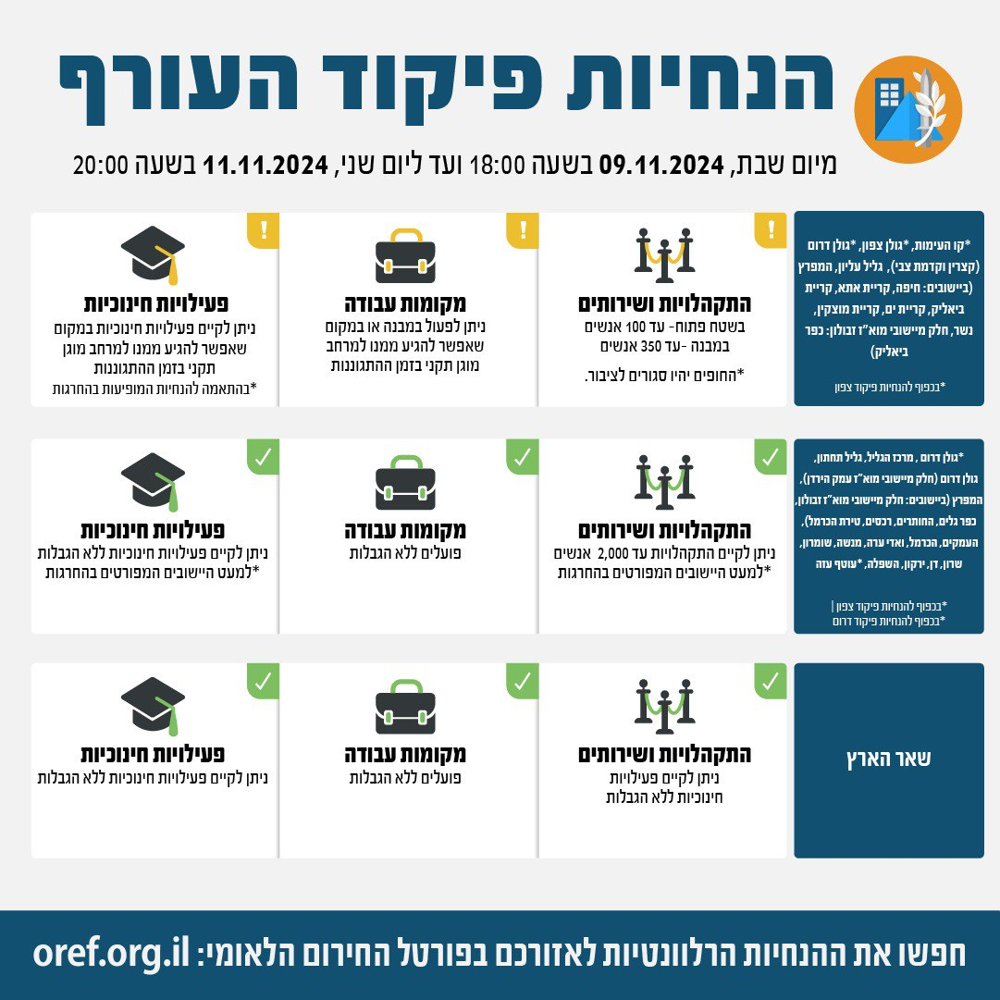

## Message 13610

דובר צה"ל:

בתום הערכת מצב בפיקוד העורף, הוחלט כי הערב (שבת) בשעה 18:00 יתעדכנו הנחיות ההתגוננות של פיקוד העורף: 

במסגרת השינויים, אזורי הנחייה גולן דרום (למעט קצרין וקדמת צבי) ומרכז הגליל- יעברו ממדרג פעילות חלקית לפעילות מלאה, עם הגבלת התקהלויות ושירותים של עד 2,000 אנשים.

יש להמשיך ולעקוב אחר ההנחיות המפורסמות על ידי פיקוד העורף באמצעי ההפצה הרשמיים.
ההנחיות המלאות מעודכנות בפורטל החירום הלאומי וביישומון פיקוד העורף.

