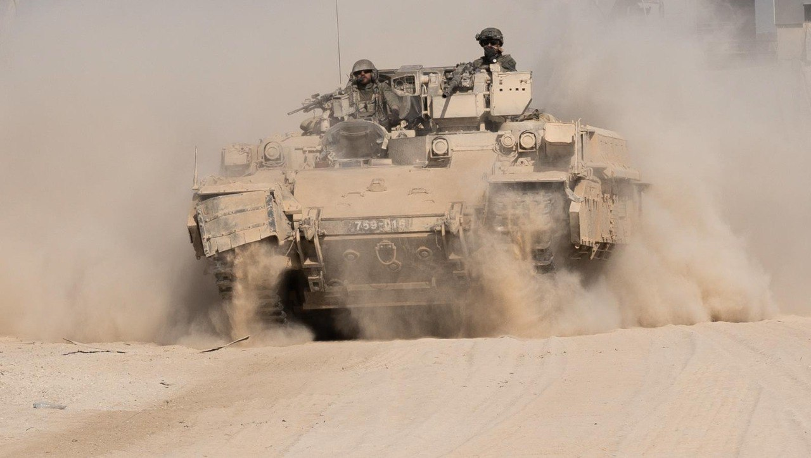

## Message 13615

דובר צה״ל:

צה"ל חיסל ביממה האחרונה עשרות מחבלים בלבנון וברצועת עזה, הושמדו מחסני אמצעי לחימה ותשתיות טרור רבים

כוחות אוגדה 162 ממשיכים לפעול במרחב ג'באליה. במהלך היממה האחרונה כוחות האוגדה חיסלו עשרות מחבלים והשמידו תשתיות טרור ומחסן אמצעי לחימה במרחב. כוחות צוות הקרב של חטיבת כפיר ממשיכים לפעול במרחב בית לאהיא וביממה האחרונה חיסלו מחבלים בסגירות מעגל מהאוויר ומהקרקע. 

לוחמי צוות הקרב של חטיבת הנח״ל ממשיכים להילחם בפיקוד אוגדת עזה (143) במרחב רפיח. במהלך היממה האחרונה, הכוחות איתרו אמצעי לחימה, חיסלו מחבלים והשמידו תשתיות טרור.
באחת התקיפות, הלוחמים זיהו באמצעות רחפן מחבלים שנעו לעברם והיוו איום. הלוחמים חיסלו אותם בסגירת מעגל מהירה.

בהכוונת פיקוד הצפון, מטוסי קרב של חיל האוויר תקפו וחיסלו עשרות מחבלים של ארגון הטרור חיזבאללה בלבנון.
בנוסף, כלי טיס של חיל האוויר תקפו עשרות מטרות טרור בלבנון וברצועת עזה בהם מחסני אמצעי לחימה, משגרים ועמדות שיגור.

