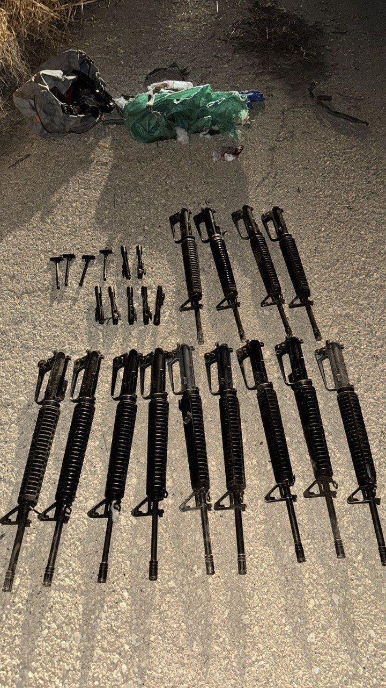

## Message 13627

דובר צה"ל:

כוחות הביטחון סיכלו הברחה של 13 כלי נשק במרחב חטיבת הבקעה והעמקים

תצפיתניות צה"ל מיחידה 636 זיהו אמש (ש') תנועה חשודה סמוך לכפר עוג׳ה שבחטיבת הבקעה והעמקים. 
כוחות מיחידת גבול ירדן של המשטרה ומיחידת מתיל״ן קפצו למרחב ועצרו שני חשודים פלסטינים.

כוחות צה״ל מגדוד 47 וגששים מחטיבת הבקעה והעמקים קפצו לבצע סריקות נרחבות במרחב, במהלכן איתרו תיקים ובהם 13 כלי נשק מסוג "M-16", לצד חלקי נשקים נוספים.

החשודים שנעצרו וכלי הנשק שהוחרמו הועברו להמשך טיפול משטרת ישראל.

