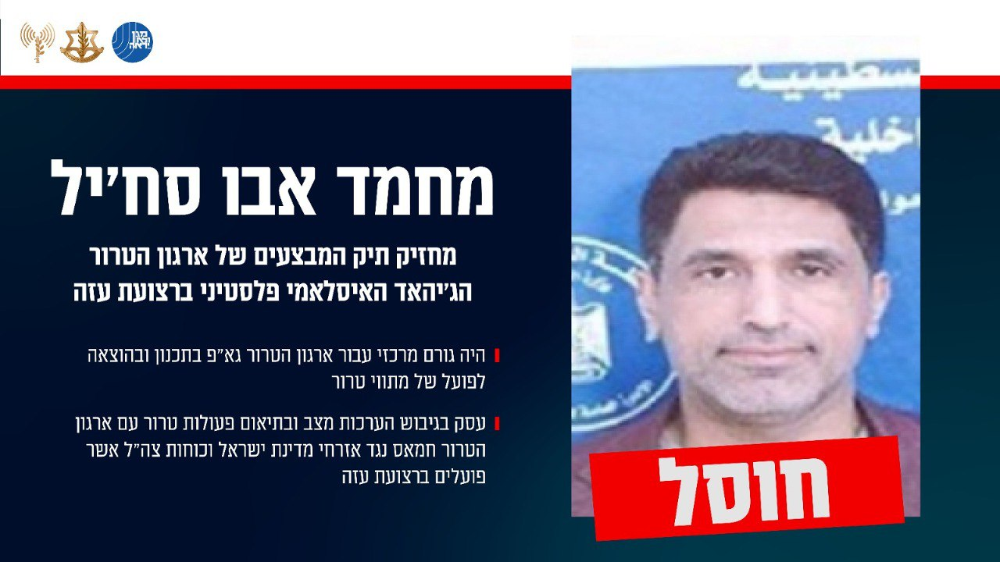

## Message 13640

הודעה משותפת לדובר צה"ל ודוברות השב"כ: 

צה"ל ושב"כ חיסלו את מחזיק תיק המבצעים של ארגון הטרור הג'יהאד האיסלאמי פלסטיני ברצועת עזה

מטוסי קרב של חיל האוויר, בהכוונה מודיעינית מדויקת של אמ"ן, שב"כ ופיקוד הדרום, תקפו באופן ממוקד אתמול (ש') וחיסלו את המחבל מחמד אבו סח'יל, מחזיק תיק המבצעים של ארגון הטרור הג'יהאד האיסלאמי פלסטיני ברצועת עזה, שפעל במתחם פיקוד ושליטה במרחב ששימש בעבר כבית ספר "פהד אלצבח" בצפון רצועת עזה. 

המחבל אבו סח'יל היווה גורם מרכזי עבור ארגון הטרור גא"פ בתכנון ובהוצאה לפועל של מתווי טרור, בגיבוש הערכות מצב ובתיאום פעולות טרור עם ארגון הטרור חמאס נגד אזרחי מדינת ישראל וכוחות צה"ל אשר פועלים ברצועת עזה.

טרם התקיפה, ננקטו צעדים רבים כדי לצמצם את הסיכוי לפגיעה באזרחים, לרבות תצפיות מהאוויר ומידע מודיעיני מדויק. 

זוהי דוגמה נוספת לשימוש השיטתי של ארגוני הטרור ברצועה בתשתיות ובאוכלוסייה אזרחית כמגן אנושי לפעילות טרור.

