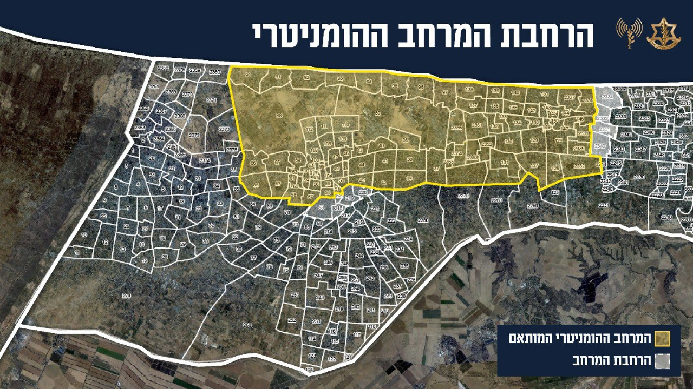

## Message 13660

דובר צה"ל:

צה״ל מרחיב את האזור ההומניטרי

צה״ל מודיע על הרחבת האזור ההומניטרי. האזור ההומניטרי המורחב כולל בתי חולים שדה שהוקמו החל מפרוץ המלחמה, מתחמי אוהלים, ציוד למחסות ואספקה של מזון, מים, תרופות וציוד רפואי שהוכנסו בתיאום מתפ״ש לקהילה הבינלאומית.

צה״ל ימשיך לפעול למימוש מטרות המלחמה ובהן פירוק החמאס והשבת כלל החטופים.

