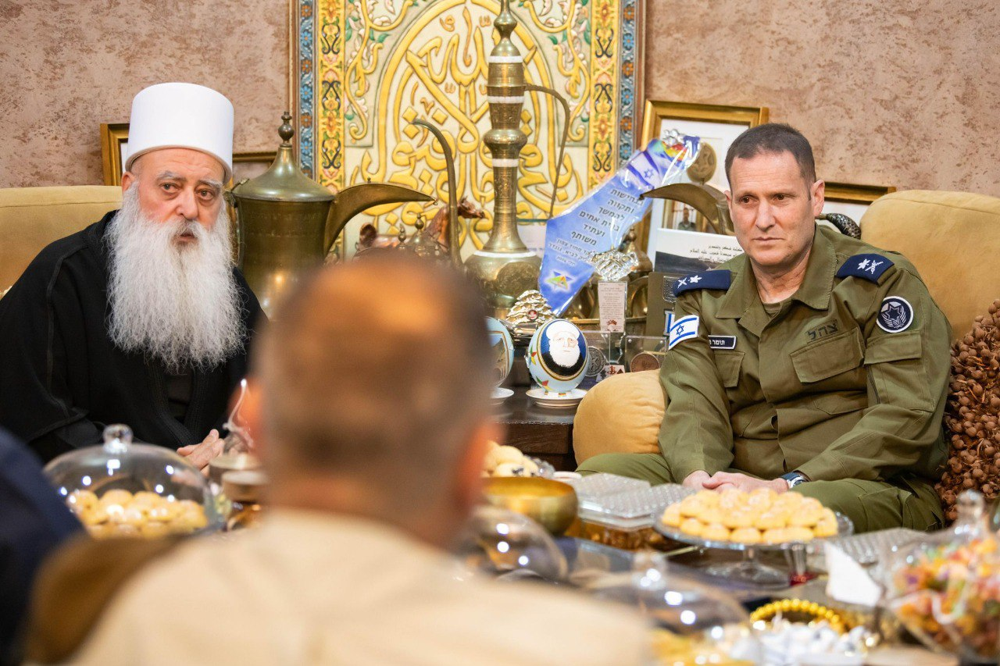

## Message 13667

מפקד חיל האוויר: "כולנו מבינים את המשימה המשותפת ואת אחדות הגורל. זאת המדינה שלנו. אין לנו מדינה אחרת" 

מפקד חיל האוויר, אלוף תומר בר נפגש אתמול (א׳) עם ראש העדה הדרוזית, מוואפק טריף, משרתי החיל הדרוזים ומשפחות שכולות מהעדה.

לפרטים המלאים: https://www.idf.il/247352

