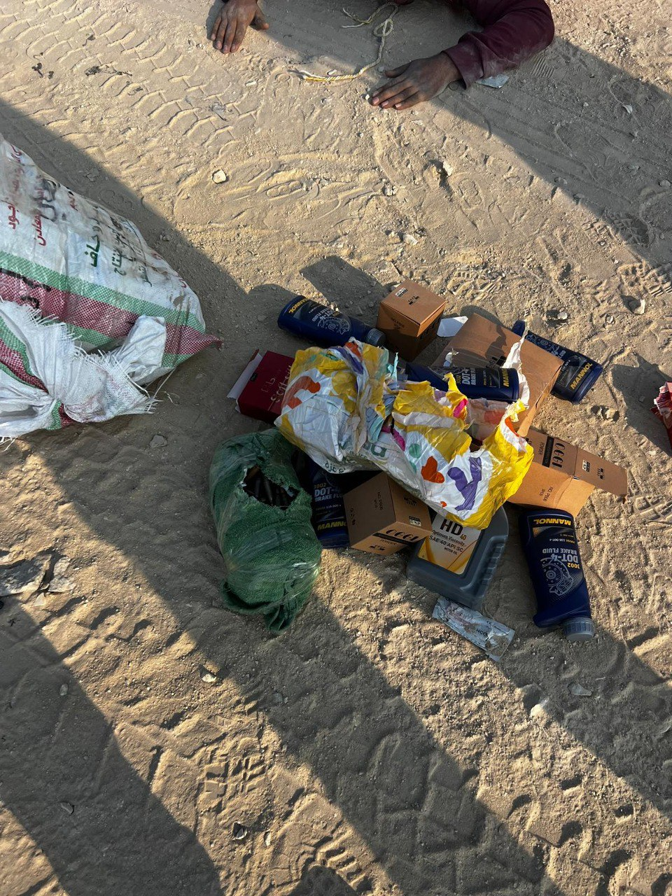

## Message 13674

דובר צה״ל:

בעת מעבר שיירה מתואמת של הקהילה הבינלאומית שבוצע אמש (א') אשר הייתה במעקב של כוחות צה״ל עלה חשד לתנועה שאינה שגרתית. בעקבותיה נעצרה השיירה לבידוק ביטחוני במעבר בציר ההומניטרי שבין צפון לדרום כוחות צה״ל איתרו שק המכיל תחמושת לנשק חם. 

כוחות צה״ל עצרו את המעורבים ואנשי השיירה ואלו והועברו לחקירת שטח על ידי יחידה 504 והמשך טיפול מול כוחות צה״ל וגורמי הביטחון לצד תחקור מול הארגון. 

נדגיש כי מדובר בשיירה פנימית שהועברה בין צפון לדרום ברצועה שאינה הועברה דרך המעברים להכנסת הסיוע ההומניטרי לרצועת עזה.

