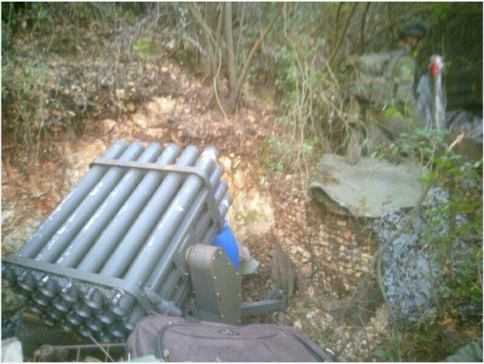

## Message 13693

דובר צה"ל:

כוחות אוגדה 36 ממשיכים בפעילות הקרקעית בדרום לבנון: חוליית מחבלים חוסלה מהאוויר, אותרו משגרים מכוונים לשטח הארץ

אוגדה 36 ממשיכה בפעילות הקרקעית בדרום לבנון נגד יעדים חדשים של ארגון הטרור חיזבאללה. הכוחות הקרקעיים מלווים בתקיפות ירי של חטיבה 282 וחיל האוויר. 
לוחמי צק״ח 188 וצק״ח גולני איתרו משגרים טעונים ומוכנים לשיגור לשטח ישראל לצד אמצעי לחימה רבים וציוד צבאי.
כוחות אוגדה 91 ממשיכים להילחם בדרום לבנון, כוחות חטיבה 769 השמידו מבנים צבאיים של ארגון הטרור חיזבאללה במרחב והחרימו ציוד צבאי ואמצעי לחימה שאותרו במבנים אזרחיים.

במהלך היממה האחרונה, חיל האוויר תקף כמאה מטרות טרור בלבנון וביניהן מבנים צבאיים, מחסני אמצעי לחימה, עשרות מחבלים ומשגרים שביצעו ירי לעבר הגליל העליון, המפרץ והגליל המערבי.
בנוסף אמש (ב'), מטוסי קרב תקפו במרחב הבקאע בעומק לבנון, אתר צבאי ובו תשתית תת קרקעית בהן פירי שיגור אשר כוונו לעבר מדינת ישראל.

