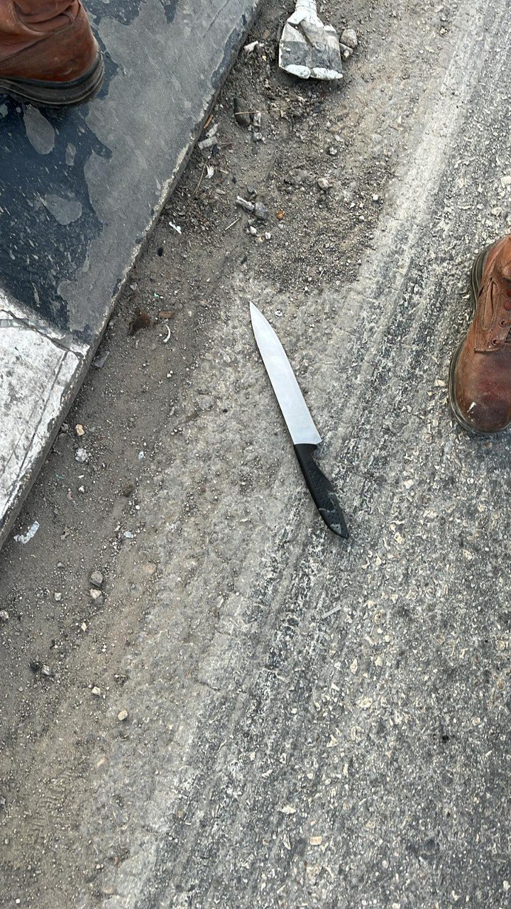

## Message 13700

דובר צה"ל:

לוחמי צה״ל סיכלו ניסיון פיגוע דקירה בדיר שרף שבשומרון

לפני זמן קצר, מחבל חמוש בסכין הגיע לצומת דיר שרף שבחטיבת שומרון וניסה לדקור לוחמי צה״ל במילואים שפעלו בעמדה הצבאית.
הלוחמים נטרלו את המחבל, ללא נפגעים לכוחותינו.

