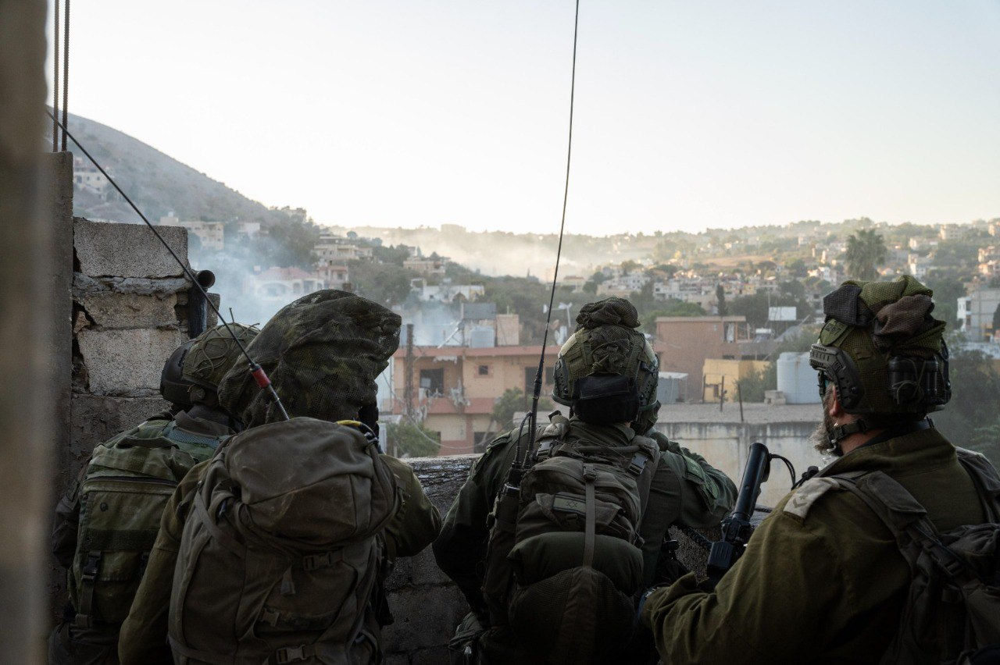

## Message 13720

דובר צה"ל:

צה"ל ושב"כ ממשיכים לחסל מחבלים שפשטו לשטח הארץ בטבח הרצחני ב-7 באוקטובר; בפיקוד הצפון כוחות אוגדה 91 ממשיכים בפעילות בדרום לבנון כנגד יעדים חדשים של חיזבאללה וחיל האוויר תקף את המשגרים מהם זוהו השיגורים לעבר נהריה ומרכז הארץ אתמול (ג')

במהלך היממה האחרונה חיל האוויר תקף יותר מ-120 מטרות של ארגוני הטרור חמאס וחיזבאללה ברצועת עזה ובלבנון. 
בהכוונת פיקוד הצפון, הותקפו בלבנון עשרות משגרים, בהם המשגרים מהם זוהו השיגורים לעבר נהריה ומרכז הארץ אתמול (ג').

אוגדה 91 ממשיכה בפעילות הקרקעית בדרום לבנון נגד יעדים חדשים של ארגון הטרור חיזבאללה. לוחמי צוות הקרב של עוצבת הקומנדו פשטו על מספר מרחבים, במקביל לכוחות חטיבה 769 ו-228 שממשיכים בפעילות ההגנה וההתקפה במרחב.
אוגדה 36 ממשיכה לפעול בדרום לבנון. הכוחות מחסלים מחבלים, מאתרים אמצעי לחימה ומשמידים תשתיות טרור במרחב.
צוות הקרב החטיבתי של גולני איתרו תוואי תת קרקעי, בו נמצאו מרחבי שהייה והצטיידות.

