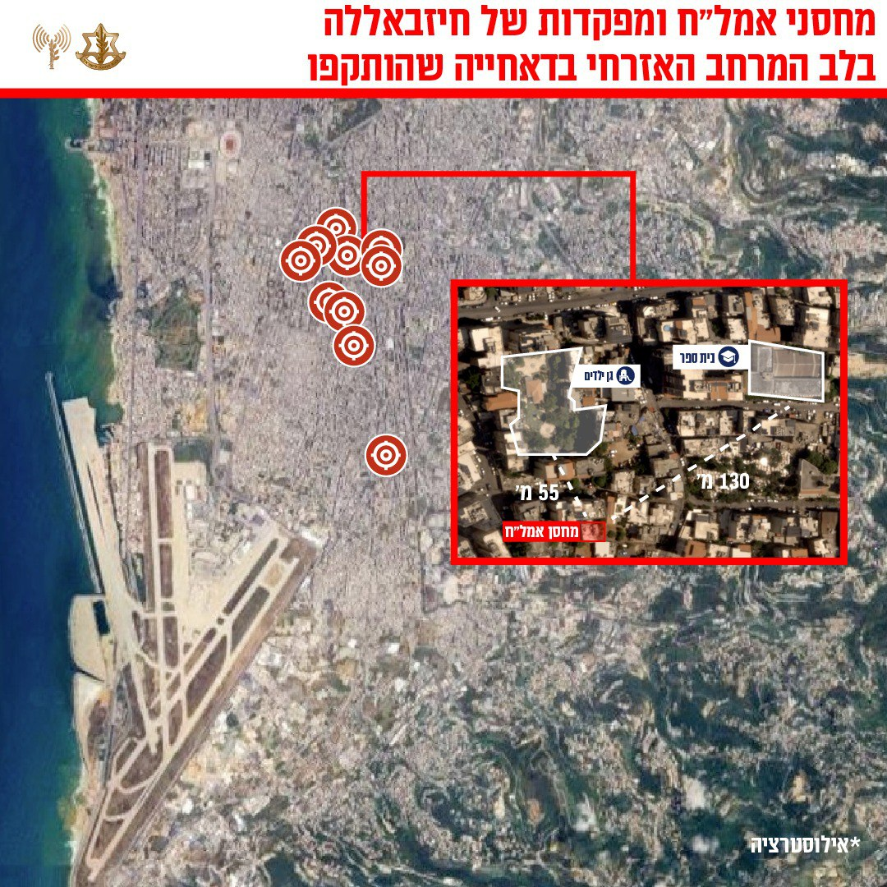

## Message 13741

דובר צה"ל:

צה״ל השלים גל תקיפות נוסף בדאחייה: ביממה האחרונה הותקפו מחסני אמצעי לחימה, מפקדות טרור צבאיות וסוללת טילים של חיזבאללה בביירות 

מטוסי קרב של חיל האוויר, בהכוונת אגף המודיעין, השלימו לפני זמן קצר סדרת תקיפות נוספת במרחב ביירות בה הותקפו מחסני אמצעי לחימה ומפקדה צבאית שהיו בשימוש ארגון הטרור חיזבאללה. 

התקיפות מהוות חלק נוסף בפגיעה של צה״ל ביכולות ארגון הטרור חיזבאללה להוציא לפועל מתווי טרור נגד כוחות צה״ל והעורף הישראלי, וממאמץ השמדת אתרי הייצור ומחסני אמצעי הלחימה שחיזבאללה הקים לאורך השנים בלב העיר ביירות.  

 המטרות שהותקפו ממוקמות בלב אוכלוסייה אזרחית. זו דוגמה נוספת לשימוש הציני של ארגון הטרור חיזבאללה של אזרחי לבנון כמגן אנושי. 

טרם התקיפה, ננקטו צעדים רבים כדי לצמצם את הסיכוי לפגיעה באזרחים, הכוללים איסוף מודיעין מקדים, חוזי מדוייק ואזהרות מקדימות לפינוי האוכלוסייה באזור.

