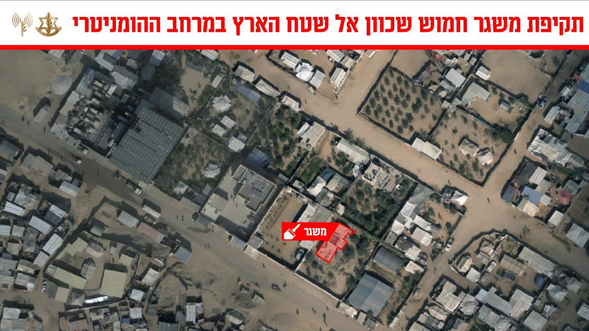

## Message 13760

דובר צה״ל:

צה"ל תקף משגר חמוש שכוון לשטח הארץ במרחב ההומניטרי בדרום רצועת עזה

כלי טיס של חיל האוויר, בהכוונה מודיעינית של אמ"ן ופיקוד הדרום, תקף והשמיד מוקדם יותר היום (ד') משגר חמוש במרחב ההומניטרי בדרום רצועת עזה. המשגר היה מכוון לשטח הארץ והיווה איום ממשי ומיידי על העורף הישראלי. 

טרם התקיפות ננקטו צעדים רבים על מנת לצמצם את הסיכוי לפגיעה באזרחים, הכוללים פינוי אוכלוסייה מהאזור בעזרת אזהרות רבות, שימוש בחימוש מדויק ובתצפיות מהאוויר. 

לאחר התקיפה נראו פיצוצי משנה המעידים על הימצאות אמצעי לחימה רבים באתר השיגור.

ארגוני הטרור ברצועה מפרים באופן שיטתי את הדין הבין לאומי, תוך ניצול אכזרי של המרחב ההומניטרי והאוכלוסייה כמגן אנושי לפעולות טרור. צה"ל ימשיך לפעול בעוצמה ובנחישות נגד כל ארגוני הטרור המשתמשים במרחב ההומניטרי כמחסה.

