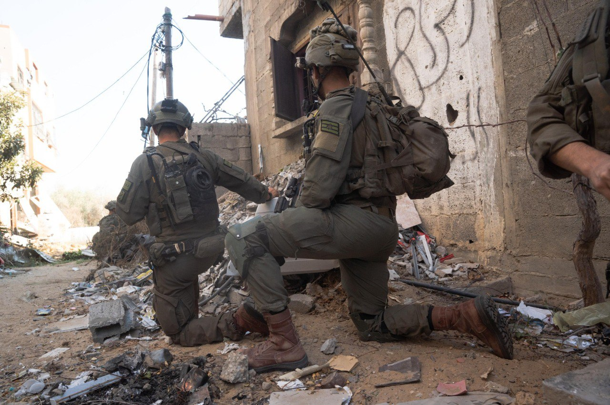

## Message 13770

ברצועת עזה, כוחות אוגדה 162 בהם צוותי הקרב של חטיבות כפיר, גבעתי ו-401 ממשיכים בלחימה העצימה בבית לאהיא ובג'באליה. הלוחמים איתרו ביממה האחרונה אמצעי לחימה רבים וחיסלו עשרות מחבלים מהקרקע ובאמצעות תקיפות של חיל האוויר. 
בסגירת מעגל, לוחמי צוות הקרב של חטיבת כפיר חיסלו ביממה האחרונה חוליית מחבלים ששיגרה טילי נ"ט וירתה לעבר הכוחות.
 
בנוסף, לוחמי צוות הקרב של חטיבת הנח"ל, בפיקוד אוגדת עזה (143), הכווינו כלי טיס שתקף מהאוויר ברפיח מחסן אמצעי לחימה וחיסל מחבל בעת שהעביר אמל"ח למחסן. 

במהלך היממה האחרונה חיל האוויר תקף יותר מ-100 מטרות טרור ברצועת עזה ובלבנון.
בין המטרות שהותקפו, מחסני אמצעי לחימה, משגרים שכוונו לעורף מדינת ישראל, מפקדות, חוליות מחבלים ותשתיות צבאיות נוספות.

