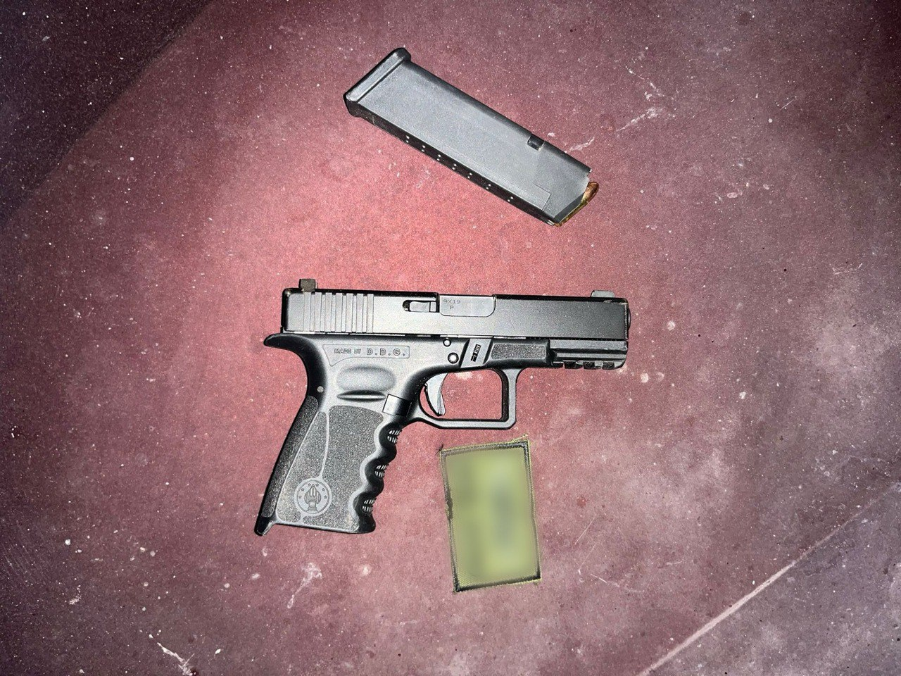

## Message 13780

הודעה משותפת לדובר צה"ל, דוברות המשטרה ודוברות שב"כ:

בפעילות ממוקדת של כוחות הביטחון: לוחמי הימ"מ בהכוונת שב"כ חיסלו ראש תשתית טרור בטולכרם ומבוקש נוסף שהיו מעורבים בביצוע פיגועים ובתכנון פעילות טרור נוספת

כוחות ימ״מ, סיירת חרוב ושב״כ פעלו אמש (ד׳) בכפר דנאבה הסמוך לטולכרם שבחטיבת מנשה למעצר מבוקשים בפעילות טרור. 

במהלך הפעילות למעצר, אחד המבוקשים החל בניסיון המלטות בעודו חמוש בנשק חם יחד עם מבוקש נוסף. לוחמי הימ״מ פתחו לעברם בירי, חיסלו אותם ונטרלו מחבל נוסף.

בפעילות חוסלו שני מחבלים, בהם מחבל שעמד בראש אחת מתשתיות הטרור של טולכרם והיה מעורב בתקופה האחרונה בביצוע פיגועים ובגיוס פעילים נוספים לפעילות טרור, לצד פעיל נוסף בתשתית הטרור.
אין נפגעים לכוחותינו.

פעילות זו מהווה חלק נוסף מרצף מבצעי נגד תשתיות טרור ומחבלים בצפון השומרון המתבצע מתחילת מלחמת ׳חרבות ברזל׳.

