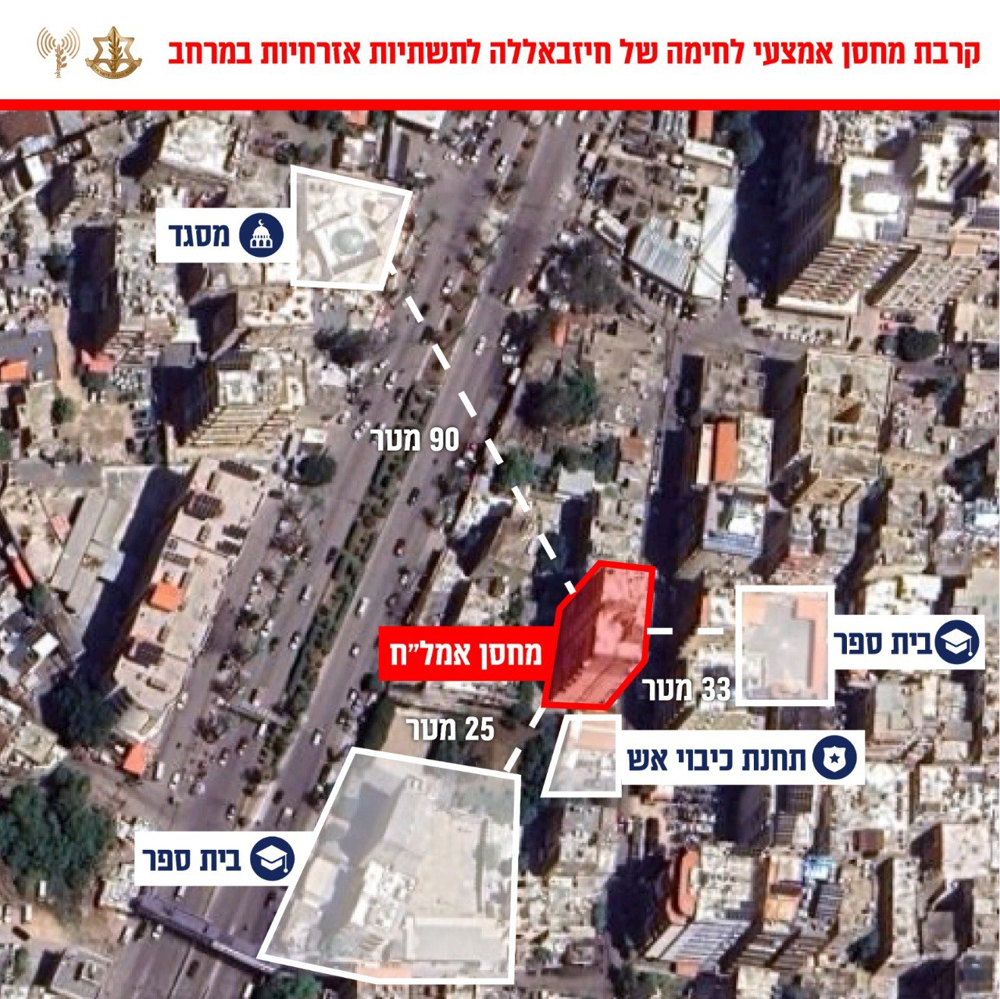

## Message 13825

דובר צה"ל:

צה״ל ממשיך לתקוף תשתיות טרור של חיזבאללה בדאחייה, הושלמו ארבעה גלי תקיפות מהבוקר

בשעות האחרונות מטוסי קרב של חיל האוויר, בהכוונת אגף המודיעין, יצאו לגל התקיפות הרביעי היום במרחב הדאחייה שבביירות. 

במהלך היום הותקפו מפקדות טרור, מחסני אמצעי לחימה, מפקדות ותשתיות טרור נוספות של חיזבאללה.

התקיפות מהוות חלק נוסף בפעולת צה״ל לפגיעה במעוז הטרור של חיזבאללה בדאחייה, ממנו ארגון הטרור מתכנן ומוציא לפועל מתווי טרור נגד אזרחי מדינת ישראל.  

כלל המטרות שהותקפו מוקמו על ידי חיזבאללה במכוון בלב האוכלוסייה האזרחית. זו דוגמה נוספת לשימוש הציני של ארגון הטרור חיזבאללה של אזרחי לבנון כמגן אנושי.

טרם התקיפה ננקטו צעדים רבים על מנת לצמצם את הסיכוי לפגיעה באזרחים, הכוללים איסוף מודיעין מקדים, תצפית מדויקת ואזהרות מקדימות לפינוי האוכלוסייה באזור.

