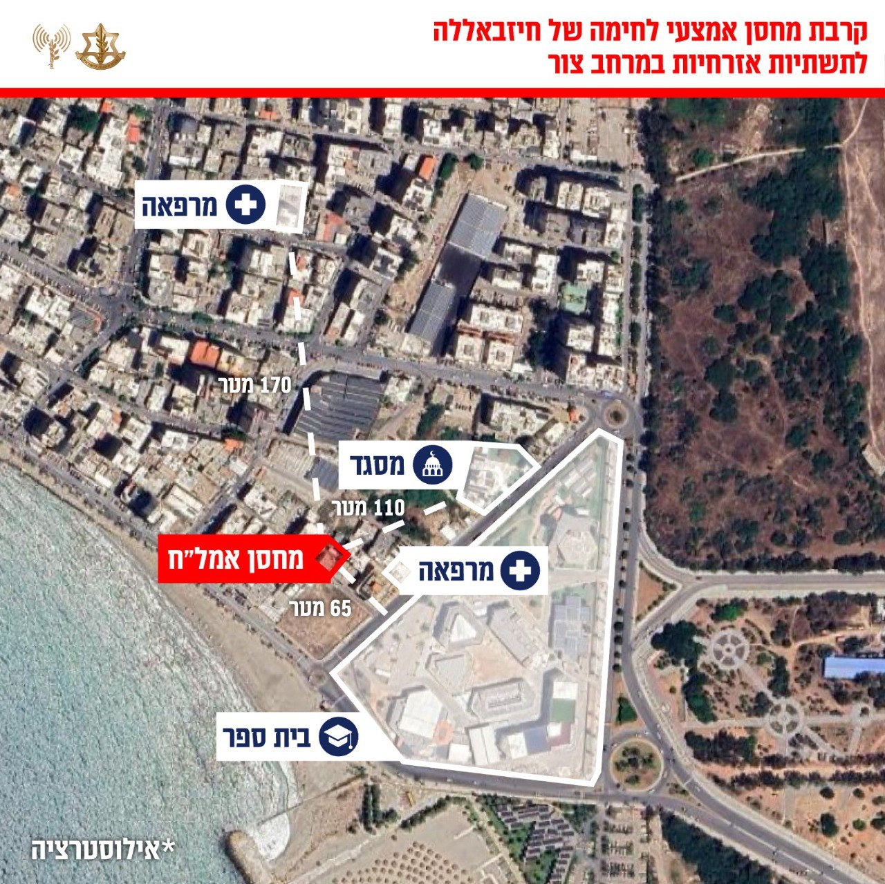

## Message 13858

דובר צה"ל:

מפקדות, מחסני אמצעי לחימה ותשתיות מודיעין: צה״ל השלים גל תקיפה על מטרות טרור של חיזבאללה במרחב צור

מטוסי קרב של חיל האוויר, בהכוונת אגף המודיעין ופיקוד הצפון, השלימו מוקדם יותר היום גל תקיפות על מטרות טרור של חיזבאללה במרחב צור שבדרום לבנון. בין המטרות שהותקפו, מפקדות, מחסני אמצעי לחימה, מבנים צבאיים ותשתיות טרור נוספות. נכסים צבאיים רבים שהותקפו משויכים ליחידת ׳עזיז׳ של חיזבאללה, האחראית על ירי ממרחב דרום-מערב לבנון לעבר שטח מדינת ישראל ופעולות טרור נוספות במרחב.

ארגון הטרור חיזבאללה מקים באופן שיטתי תשתיות צבאיות במרחבים אזרחיים ברחבי מדינת לבנון זאת על מנת לבצע פעולות ומתווי טרור תוך הטמעות פעיליו ומפקדיו באוכלוסיה אזרחית. שיטה זו מסכנת באופן ישיר את אזרחי מדינת לבנון.

טרם התקיפות ננקטו צעדים רבים על מנת לצמצם את הסיכוי לפגיעה באזרחים, הכוללות איסוף מודיעין מקדים, תצפית מדויקת ואזהרות מקדימות לפינוי האוכלוסייה באזור.

