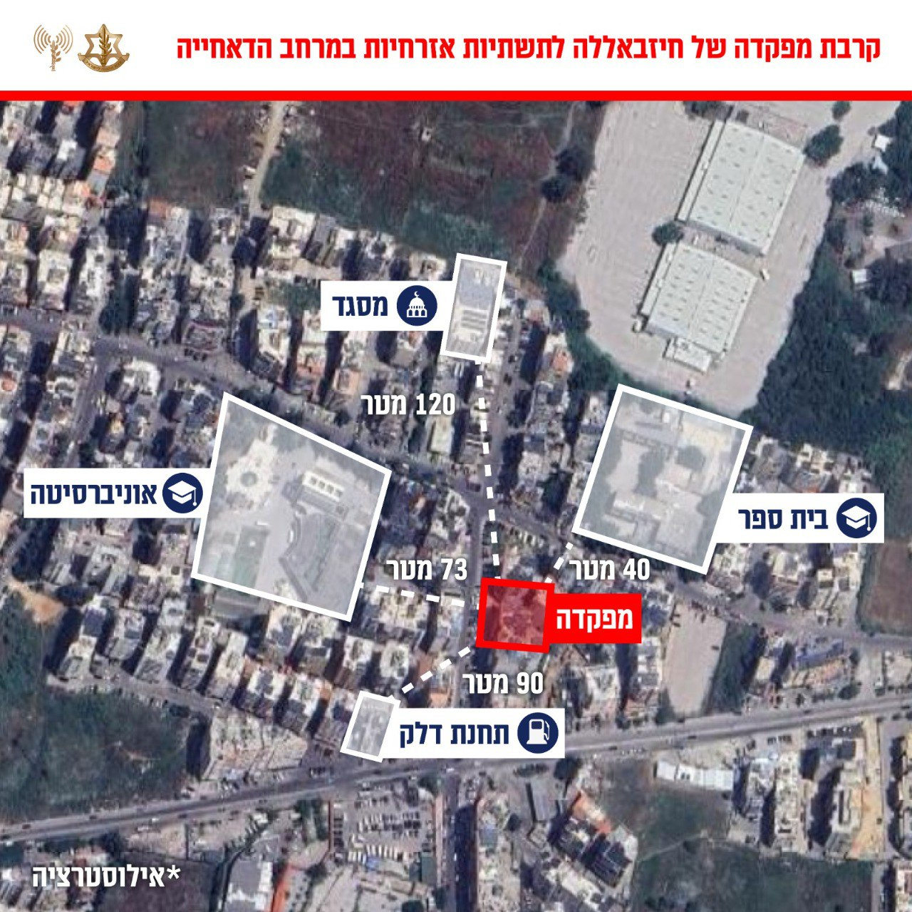

## Message 13860

דובר צה"ל:

כ-50 מטרות טרור הותקפו בדאחייה השבוע: צה״ל השלים גל תקיפות רביעי היום בביירות

מטוסי קרב של חיל האוויר, בהכוונת אגף המודיעין, השלימו מוקדם יותר הערב את גל התקיפות הרביעי היום על מפקדות צבאיות של ארגון הטרור חיזבאללה במרחב הדאחייה שבביירות.

בשבוע האחרון צה״ל תקף כ-50 מטרות טרור בדאחייה, מעוז הטרור של חיזבאללה ממנו ממשיכים לתכנן ולהוציא לפועל מתווי טרור נגד מדינת ישראל.

ארגון הטרור חיזבאללה מקים באופן שיטתי תשתיות טרור במרחבים אזרחיים ברחבי מדינת לבנון, על מנת לבצע פעולות טרור תוך הטמעות פעיליו ומפקדיו באוכלוסיה אזרחית. שיטה זו מסכנת באופן ישיר את אזרחי מדינת לבנון.

טרם התקיפות ננקטו צעדים רבים על מנת לצמצם את הסיכוי לפגיעה באזרחים, כגון: איסוף מודיעין מקדים, תצפית מדויקת ואזהרות מקדימות לפינוי האוכלוסייה באזור.

