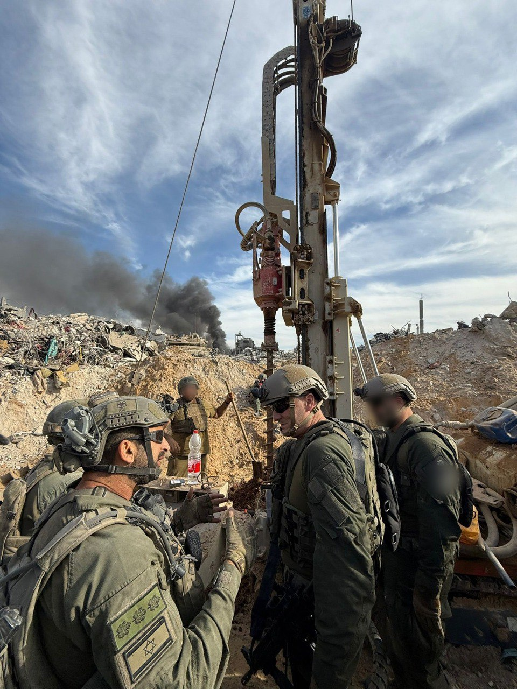

## Message 13878

דובר צה״ל: 

מפקד חיל האוויר למפקדים והלוחמים של אוגדה 162 ברצועת עזה: ״מעל לשנה כלל מערכי חיל האוויר פועלים כנף אל כתף עם הלוחמים האמיצים בשטח״

מפקד חיל האוויר, אלוף תומר בר, ביקר היום (א׳) במרחב ג׳באליה שברצועת עזה, וקיים סיור שטח עם מפקד אוגדה 162, תת-אלוף איציק כהן, מפקד חטיבת גבעתי, אלוף-משנה לירון בטיטו ומפקדים נוספים. 

המפקדים סקרו בפני האלוף על תמונת המצב, ההישגים המבצעיים במרחב והתוכניות להמשך בדגש על שיתוף הפעולה בין האוויר לקרקע.

מדברי מפקד חיל האוויר, אלוף תומר בר: ״מעל שנה כלל מערכי חיל האוויר פועלים כנף אל כתף עם הלוחמים האמיצים בשטח. אני רוצה שתדעו שבזמן שאתם פה נלחמים מול האויב על הקרקע, בחיל האוויר פועלים 24/7 לתת מעטפת אש אפקטיבית לכל כוח בכל מקום".

מדברי מפקד אוגדה 162, תת-אלוף איציק כהן: "מעל לשנה אנחנו נלחמים בכל רחבי עזה, כאשר יחד איתנו כל הזמן מעל אנשי חיל האוויר. יחד למדנו לסגור מעגלים בצורה אפקטיבית, לפגוע באויב בעוצמה ולהכריע כל מרחב אליו נגיע. גם פה בג'באליה אנחנו מפעילים אש אווירית משמעותית וזה מרכיב חשוב בקרב שלנו במרחב".

