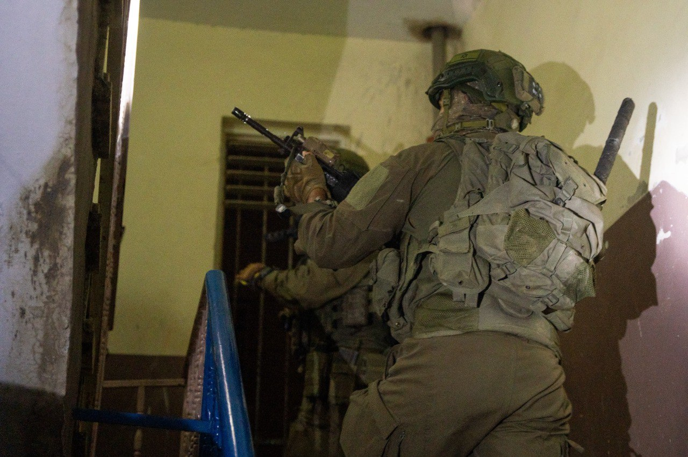

## Message 13887

דובר צה"ל:

המערכה באמצעי הלחימה באוגדת יהודה ושומרון: שבע מחרטות לייצור אמצעי לחימה אותרו והוחרמו בחברון, נשק אותר במרחב התפר במנשה

כוחות הביטחון פעלו במהלך הלילה בחברון שבחטיבת יהודה והחרימו שבע מחרטות לייצור אמצעי לחימה.

בפעילות בדהיישה שבחטיבת עציון, הכוחות תחקרו עשרות חשודים במעורבות בפעילות טרור. באל מועייר שבחטיבת בנימין, הוחרמו מעל עשרה רכבים בלתי חוקיים ובסילוואד שבגזרת החטיבה הכוחות עצרו שני מבוקשים.

אמש (א'), במהלך סריקות של כוחות צה״ל בגדר התפר במרחב הכפר זיתא שבחטיבת מנשה, אותר והוחרם כלי נשק מסוג "M-16".

המבוקשים שנעצרו ואמצעי הלחימה שהוחרמו הועברו להמשך טיפול כוחות הביטחון, אין נפגעים לכוחותינו.

