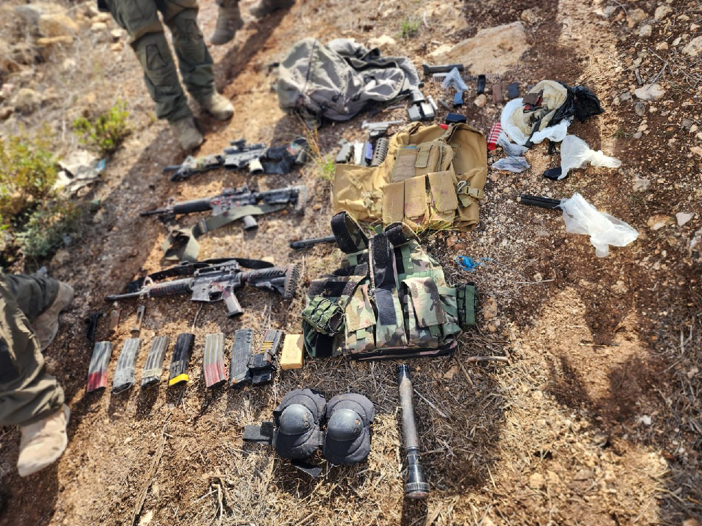

## Message 13938

הודעה משותפת לדובר צה"ל, דוברות המשטרה ודוברות שב"כ:

כוחות צה"ל, שב"כ ומג"ב פועלים מהלילה לסיכול טרור במרחב ג׳נין שבחטיבת מנשה: שלושה מחבלים חוסלו בחילופי אש

כוחות צה"ל, מג״ב ושב״כ פועלים מהלילה במרחב ג׳נין כחלק מרצף המבצעים לסיכול טרור בצפון השומרון.

בשעות הבוקר, מסתערבי מג״ב איו״ש פעלו בכפר קבאטיה למעצר מבוקש, במהלך הפעילות מחבלים פתחו בירי לעבר הלוחמים מתוך מבנה בו הסתתר המבוקש.
הלוחמים פתחו בנוהל ״סיר לחץ״ על המבנה, במהלכו חוסל המבוקש לצד שני מחבלים חמושים, עליהם אותרו שלושה נשקים מסוג ״M16״ וציוד צבאי נוסף.

המבוקש שחוסל, המחבל ראיד חנאישה, היה כלוא בעבר על רקע פעילות טרור ועיסוק באמצעי לחימה, והיה מעורב לאחרונה בפיגועי ירי ומטענים לעבר כוחות צה״ל, ללא נפגעים לכוחותינו.

כמו כן, הלוחמים איתרו שלושה נשקים נוספים והשמידו שתי מעבדות מטענים לצד מטענים נוספים שהוטמנו מתחת לצירים לפגיעה בכוחותינו. 
הלוחמים ממשיכים לפעול במרחב, אין נפגעים לכוחותינו.

