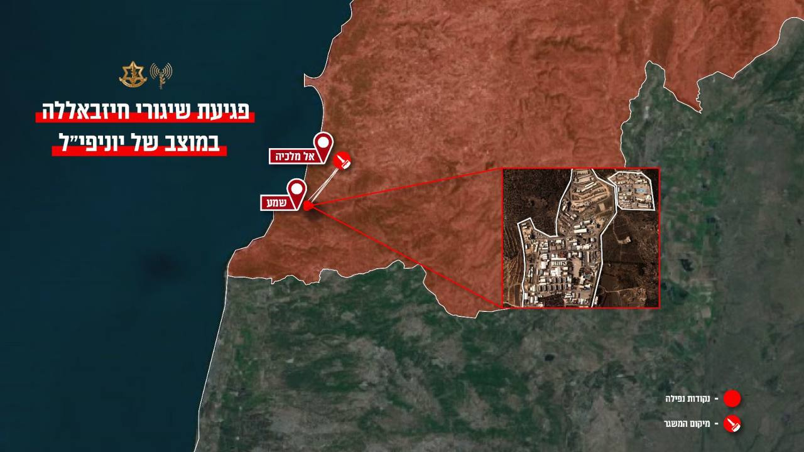

## Message 13943

דובר צה"ל:

מוקדם יותר היום (ג'), בסמוך לשעה 13:30, נפגע מוצב יוניפי״ל במרחב ׳שמע׳ בדרום לבנון, כתוצאה ממספר רקטות ששיגר ארגון הטרור חיזבאללה ממרחב 'אל מלכיה' שבדרום לבנון.

פגיעה זו מתווספת לשיגור נוסף שביצע ארגון הטרור חיזבאללה ופגע במוצב יוניפי״ל במרחב רמיה בדרום לבנון בשעה 9:50 הבוקר, כפי שדווח מוקדם יותר היום.

