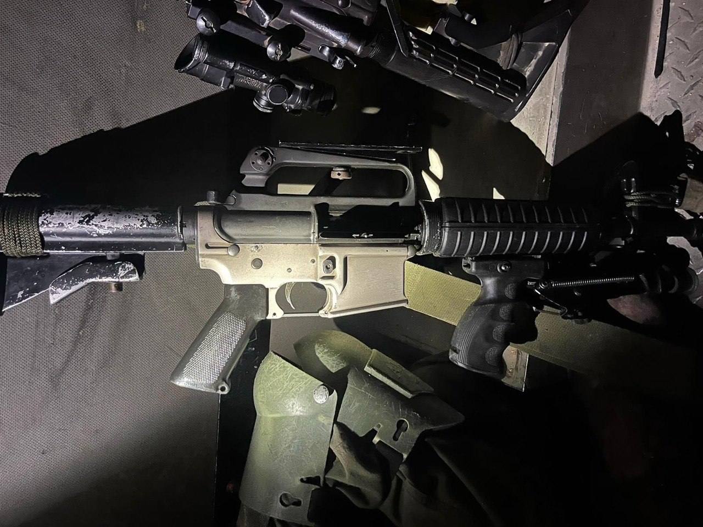

## Message 13960

דובר צה״ל:

הפעילות לסיכול טרור ביהודה ושומרון נמשכת: חמישה מחבלים חוסלו לצד השמדת מעבדות מטענים והחרמת מחרטות וכלי נשק

כוחות צה"ל, מג״ב ושב״כ פועלים מזה שתי יממות במבצע בג׳נין כחלק מרצף המבצעים לסיכול טרור בצפון השומרון. הכוחות חיסלו עד כה חמישה מחבלים, והחרימו שבעה כלי נשק. כמו כן הושמדו ארבע מעבדות מטענים, חמ"ל מצלמות ועשרות מטענים.

בכפר עוריף שבחטיבת שומרון הוחרמו חמש מחרטות לייצור אמצעי לחימה, הוחרמו חלקי נשק ונעצר מבוקש. בנוסף, בחטיבת עציון ובחטיבת אפרים נעצרו שישה מבוקשים.

במבצע חטיבתי ביהודה שבוצע כחלק מהגברת פעילות הסיכול לקראת חריג יהודי במערת המכפלה, נעצרו ארבעה מבוקשים, הוחרם כלי נשק ותוחקרו עשרות חשודים בפעילות טרור.
אין נפגעים לכוחותינו.

