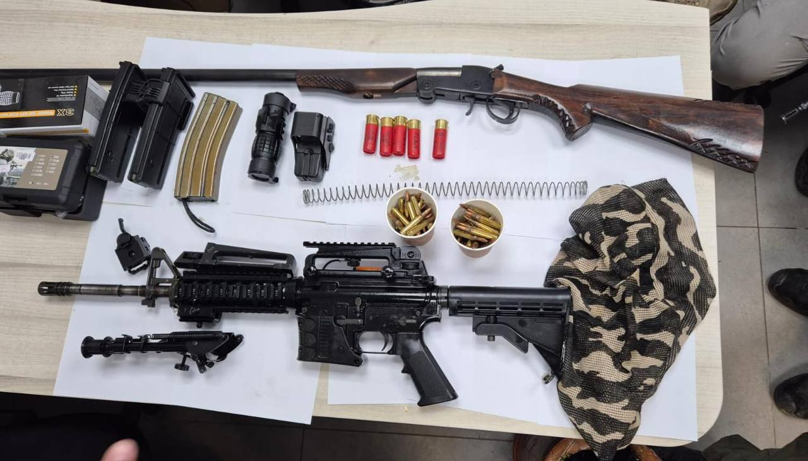

## Message 14009

כוחות צה״ל, שב״כ ומג״ב פעלו במהלך השבוע למעצר של יותר מ-40 מבוקשים ברחבי יהודה ושומרון והחרימו יותר מ-15 נשקים.

במהלך הלילה לוחמי מג״ב איתרו שני נשקים, תחמושת ואמצעי לחימה נוספים בבית לחם שבחטיבת עציון. בג׳ילקמוס שבחטיבת מנשה לוחמי צה״ל עצרו מבוקש והחרימו עשרות אלפי ש״ח של כספי טרור. בחטיבות אפרים ויהודה נעצרו שלושה מבוקשים והוחרמו ציוד צבאי ואמצעי לחימה נוספים.
המבוקשים שנעצרו הועברו להמשך חקירת כוחות הביטחון, אין נפגעים לכוחותינו.

