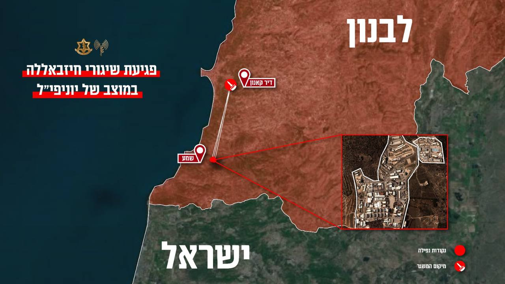

## Message 14032

דובר צה״ל:

מוצב של יוניפי״ל נפגע במרחב 'שמע' שבדרום לבנון אתמול  (ו'), בעקבות מספר שיגורים שביצע ארגון הטרור חיזבאללה ממרחב דיר קאנון שבדרום לבנון. כתוצאה מהפגיעה נפצעו מספר חיילי יוניפי"ל ששהו במוצב.

מדובר בפגיעה נוספת של ארגון הטרור חיזבאללה במוצבי יוניפי״ל השבוע, זאת לאחר שלפני מספר ימים (ג') פגע במוצבים של הכוח במרחב שמע ובמרחב רמיה.

