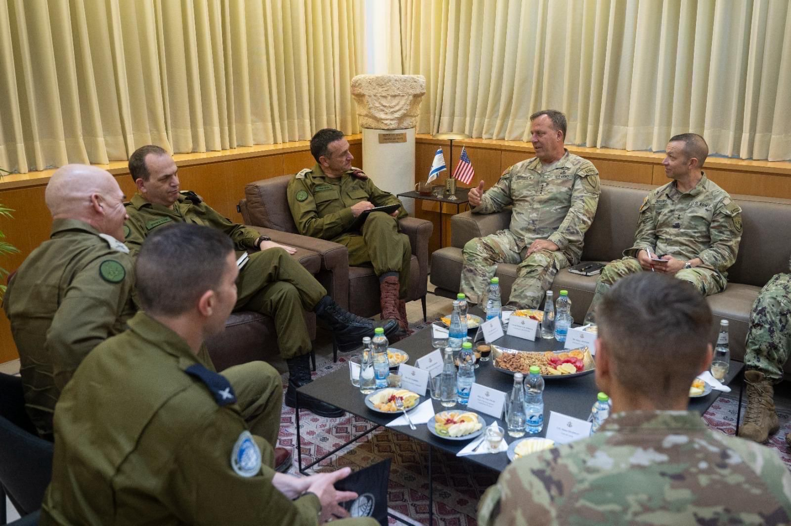

## Message 14039

דובר צה״ל: 

מפקד פיקוד המרכז בצבא ארה"ב (CENTCOM), גנרל (****) מייקל אריק קורילה נחת אתמול (ו׳) בישראל, כאורחו הרשמי של ראש המטה הכללי, רב-אלוף הרצי הלוי. 

הרמטכ״ל ומפקד סנטקום קיימו הערכת מצב משותפת עם ראש אגף המבצעים ומפקד פיקוד הצפון, בנושאים ביטחוניים-אסטרטגיים ובדגש על לבנון. 

צה"ל ימשיך להעמיק את הקשר עם צבא ארצות הברית מתוך מחויבות לחיזוק היציבות האיזורית והתיאום בין הצבאות.

