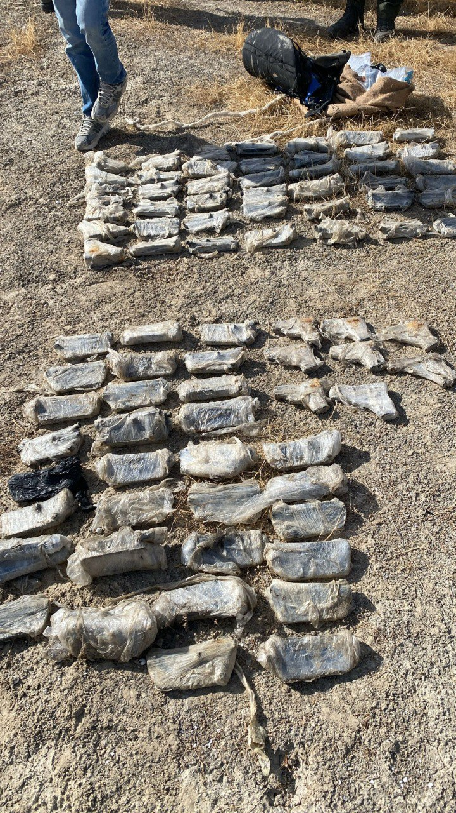

## Message 14086

הודעה משותפת לדובר צה״ל ודוברות המשטרה:

כוחות הביטחון סיכלו הברחה של 14 אקדחים ויותר מ-65 חלקי נשק במרחב חטיבת הבקעה והעמקים

במסגרת פעילות כוחות הביטחון בחטיבת הבקעה והעמקים נגד הברחות נשק ואמצעי לחימה, סוכלה הברחה של אמצעי לחימה לישראל במרחב בקעת הירדן.

במהלך הפעילות, תצפיות צה"ל זיהו תנועה חשודה באזור גשר אדם שבחטיבת הבקעה והעמקים. 
כוחות צה״ל מחטיבת הבקעה והעמקים, כוחות מיחידת גבול ירדן במחוז ש״י ומתיל״ן מג״ב קפצו לנקודה ואיתרו שני תיקים שהכילו 14 אקדחים ו-65 חלקי נשק.

במהלך סריקות במרחב, הכוחות עצרו חשוד אשר הועבר להמשך טיפול של היחידה המרכזית במחוז ש"י יחד עם האמל"ח שנתפס.

