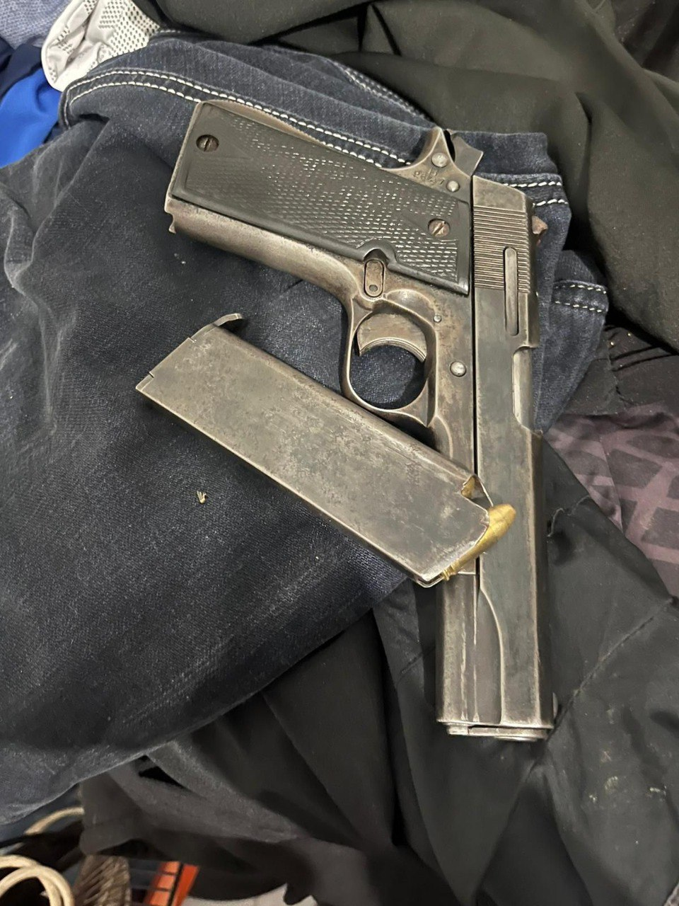

## Message 14135

דובר צה"ל:

כוחות הביטחון הרסו את ביתו של המחבל שביצע את הפיגוע סמוך למחסום תרקומיא בספטמבר 2024

כוחות צה"ל, שב"כ ומג"ב פעלו באדנא שבחטיבת יהודה והרסו, בעזרת כלים הנדסיים, את ביתו של המחבל מהנד אלעסאודה, שביצע את פיגוע הירי בסמוך למחסום תרקומיא ב-1 בספטמבר 2024, בו נהרגו רפ"ק אריק בן אליהו ז"ל, רנ"ג הדס ברנץ ז"ל ורס"ב רוני שקורי ז"ל.

בטובאס שבחטיבת הבקעה והעמקים נעצרו שני מבוקשים והוחרם אקדח, הלוחמים ממשיכים לפעול במרחב. ארבעה מבוקשים נוספים נעצרו הלילה באיו״ש, אין נפגעים לכוחותינו.

