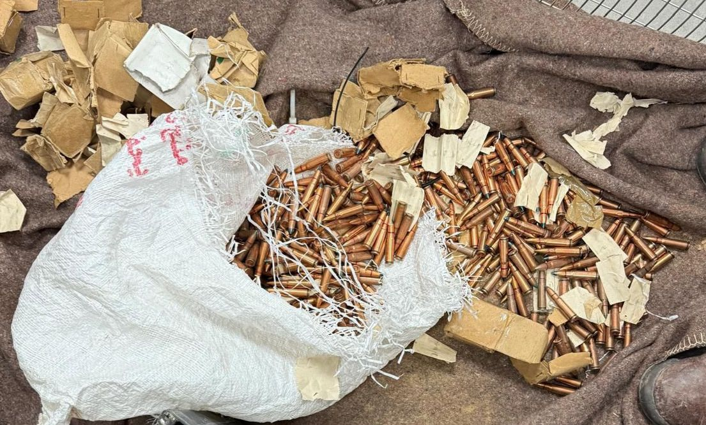

## Message 14156

דובר צה״ל:

סוכלה הברחת אמצעי לחימה במרחב גבול מצרים

כוחות צה״ל זיהו מוקדם יותר היום (ד׳) רחפן שחצה משטח מצרים לשטח מדינת ישראל במרחב חטיבת פארן. 
הרחפן הופל ע״י כוח של גדוד קרקל, אשר הגיעו לנקודה ואיתרו על הרחפן ארבעה רובים, חמש מחסניות ומאות קליעים.   
אמצעי הלחימה שאותרו הועברו לטיפול כוחות הביטחון.

