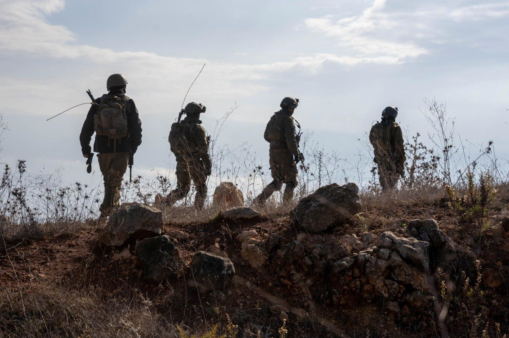

## Message 14181

דובר צה״ל:

כוחות צה״ל פרוסים בדרום לבנון

מאז כניסת הסכם הפסקת האש, כוחות צה"ל ממשיכים להיות פרוסים בדרום לבנון להגנה על מדינת ישראל ואזרחיה.

אמש (ה׳) מפקד אוגדה 91, תת-אלוף שי קלפר ביקר את הכוחות הלוחמים במרחב.

