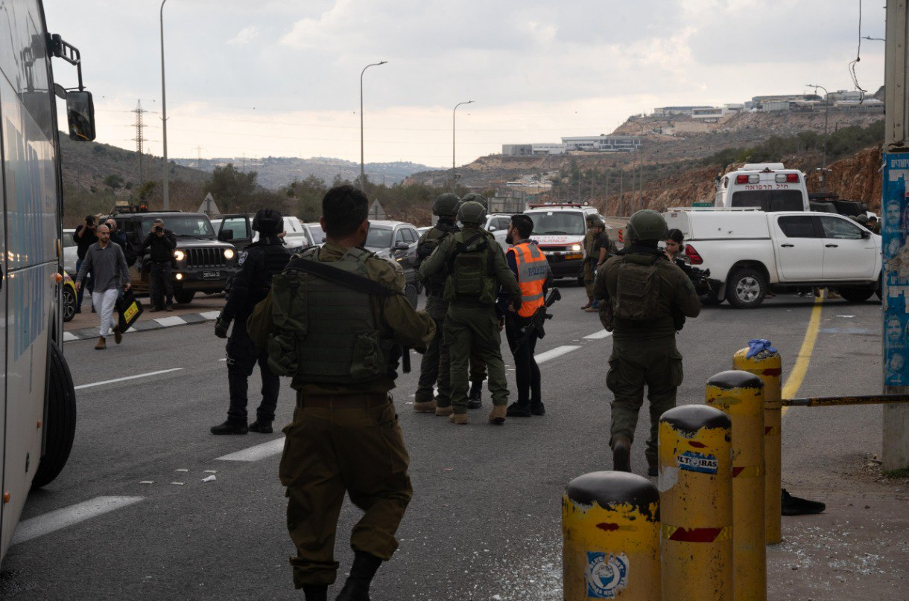

## Message 14187

דובר צה״ל:

מחבל חמוש פתח בירי מוקדם יותר היום (ו׳) לעבר אוטובוס ישראלי במרחב גיתי אבישר שבחטיבת אפרים וגרם לנפגעים ולנזק. 
כוחות צה"ל חיסלו את המחבל בנקודה, סרקו וביצעו חסימות במרחב.

מפקד פיקוד המרכז, אלוף אבי בלוט, מפקד אוגדת איו״ש, תת-אלוף יקי דולף, מח״ט אפרים, אל״ם נתנאל שמכה ומפקדים נוספים מבצעים כעת הערכת מצב בזירת הפיגוע.
בנוסף, התבצעה הערכת מצב עם מפקד מחוז ש״י, ניצב משה פינצ׳י ומפקדים נוספים.

כתוצאה מהפיגוע, ארבעה חיילי צה"ל נפצעו באורח קל ופונו לקבלת טיפול רפואי בבית חולים, משפחותיהם עודכנו.

