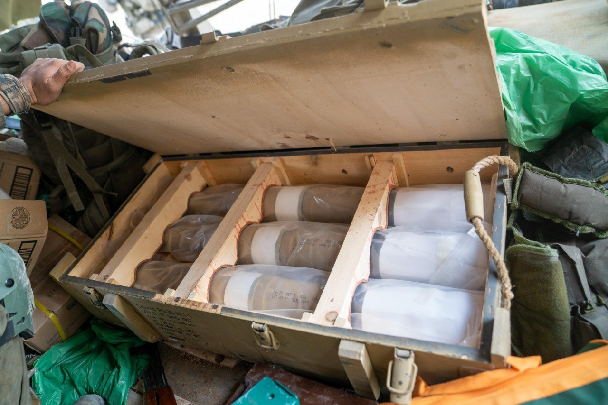

## Message 14199

דובר צה״ל:

במהלך סריקות של כוחות צה״ל במרחב דרום לבנון ביממה האחרונה, הלוחמים איתרו אמצעי לחימה שהוסתרו במסגד ששימש מחבלי חיזבאללה, והחרימו אותם.  

בנוסף, במהלך היממה האחרונה כוחות צה"ל פעלו להרחקת חשודים ממרחב דרום לבנון.

צה״ל פרוס במרחב דרום לבנון ויאכוף כל הפרה של הסכם הפסקת האש.

