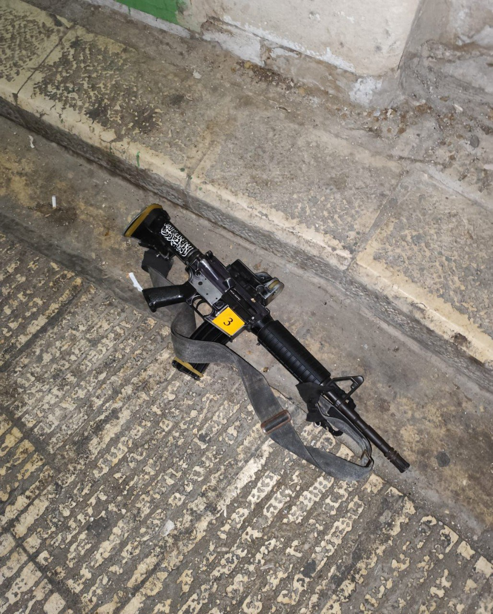

## Message 12018

דובר צה"ל:

חילופי אש עם מחבלים במבצע בשכם: שני מחבלים חוסלו, אחד מהם מחבל מרכזי שקידם והוציא לפועל פיגועי טרור ביהודה ושומרון

כוחות צה"ל, שב"כ ומג"ב ממשיכים לפעול במבצע המשך שהתחיל ביום ראשון בערב בשכם שבחטיבת שומרון. 

כחלק מהמבצע, בהכוונה מודיעינית של שב"כ, לוחמי חטיבת כפיר חיסלו הבוקר את המחבל, עבד שאהין, אשר קידם והוציא לפועל מתווי טרור וירי לעבר כוחות צה״ל ביהודה ושומרון ופעל בתקופה האחרונה לגיוס חוליית מחבלים לביצוע פיגועים נוספים ממרחב שכם. 
הכוחות החרימו את הנשק ששימש את המחבל.

לוחמי דובדבן פעלו למעצר שני מבוקשים בתוך מבנה במחנה בלאטה, שם נפתחה עליהם אש מתוך המבנה. הלוחמים השיבו באש, חיסלו מחבל ופצעו את המחבל השני.
עד כה, הכוחות איתרו מטענים, אקדח, תחמושת וחלקי נשק במרחבים אזרחים בהם בית קפה ובחנויות במרחב.

