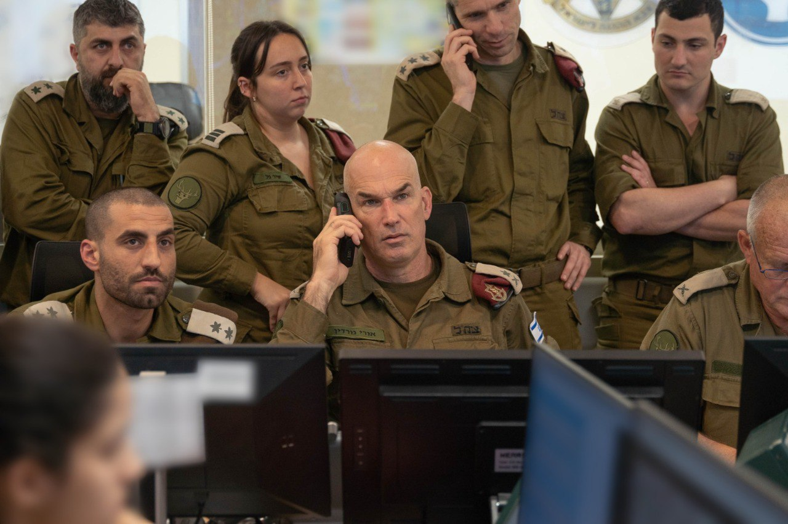

## Message 12055

דובר צה"ל:

מפקד פיקוד הצפון, אלוף אורי גורדין קיים הערכת מצב עם מפקד אוגדה 98, תא"ל גיא לוי ומפקדים נוספים בעת התקדמות הכוחות ליעדים בלבנון בקדמית האוגדה סמוך לגבול. 

במהלך הלילה, לוחמי צוותי הקרב של חטיבת הצנחנים, עוצבת הקומנדו וחטיבה 7 בפיקוד אוגדה 98 החלו בפעילות קרקעית ממוקדת ומתוחמת במספר מרחבים בדרום לבנון במטרה להשמיד תשתיות טרור מהם ארגון הטרור חיזבאללה תכנן לתקוף את מדינת ישראל. 

במהלך הפשיטות לוחמי הצנחנים איתרו עשרות אמצעי ומתחמי לחימה, ולוחמי יחידת אגוז איתרו מתחם משגרי רקטות ומטענים מוחבאים במצבורים והשמידו מתחם לחימה פעיל של מחבלי חיזבאללה. 

כמו כן, במהלך היממה האחרונה חיל האוויר תקף יותר מ-100 תשתיות טרור ומטרות בסיוע ללוחמים. 

מדברי מפקד פיקוד הצפון, אלוף אורי גורדין: ״אנחנו יצאנו למהלך שיצאנו אליו הערב, כש-98 מובילה את המהלך הזה. התקפות ממוקדות כנגד מרחבי ההיערכות של רדואן, כנגד המרחבים ההתקפיים שמאיימים על יישובי הצפון, לאתר אותם ולהשמיד אותם. נעשה את הצעד הזה כדי שאפשר יהיה להחזיר את תושבי הצפון הביתה, אנחנו נחושים, אתם מובילים, תמשיכו בדרך הזו״.

