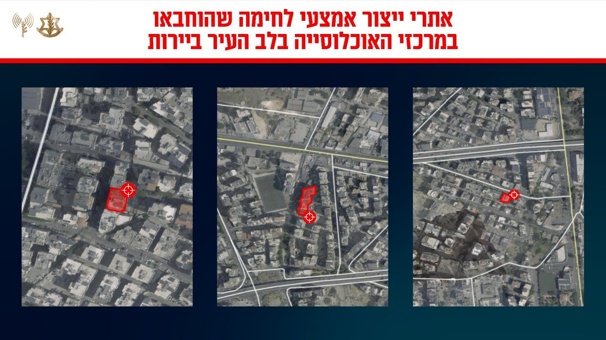

## Message 12071

דובר צה"ל:

צה״ל ממשיך להשמיד תשתיות טרור שחיזבאללה מיקם בלב האוכלוסיה האזרחית ברובע הדאחייה שבבירות

מטוסי קרב של חיל האוויר בהכוונה מודיענית מדויקת של אגף המודיעין, ביצעו שורה של תקיפות ממוקדות בימים האחרונים ברחבי ביירות כנגד מספר אתרי יצור אמצעי לחימה ותשתיות טרור נוספות במרחב. 
טרם התקיפה ננקטו צעדים רבים בכדי לצמצם את הסיכוי בפגיעה בבלתי מעורבים, אזהרות מקדימות לאוכלוסיה באזור. 
ארגון הטרור חיזבאללה ממקם את אתרי הייצור ואמצעי הלחימה שלו לרבות מתחת לבנייני מגורים בלב העיר ביירות ומביא לסיכון האוכלוסייה באזור. 

התקיפות נועדו להביא לפגיעה ביכולות הארגון, ובשעה זו צה״ל ממשיך לתקוף בעוצמה לפגיעה ולגריעת היכולות והתשתיות הצבאיות של חיזבאללה.

