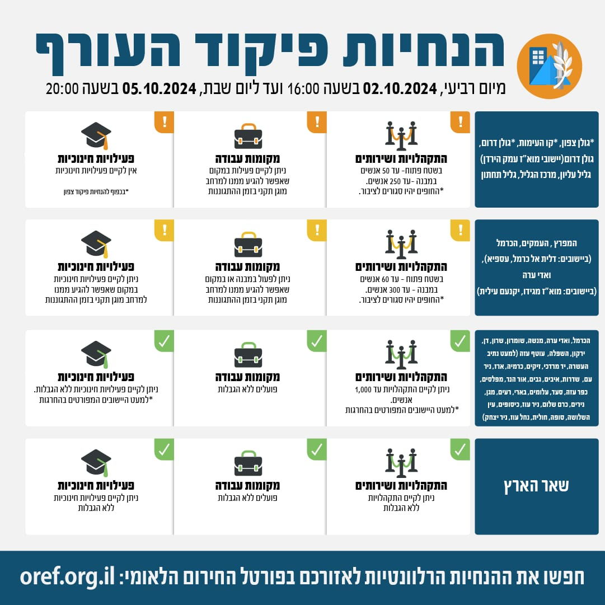

## Message 12091

דובר צה"ל:

שינויים במדיניות ההתגוננות של פיקוד העורף

בתום הערכת מצב, הוחלט כי החל מהיום (ד'), בשעה 16:00, יתעדכנו הנחיות ההתגוננות של פיקוד העורף באזורי ההנחיה קו העימות, גולן צפון, גולן דרום (יישובי מוא"ז עמק הירדן), גליל עליון, מרכז הגליל וגליל תחתון. 
במסגרת השינויים באזורים הנ"ל ניתן יהיה לקיים התקהלויות ושירותים של עד 50 אנשים בשטח פתוח (במקום 10 אנשים עד כה) ועד 250 במבנה (במקום 150 עד כה) . כמו כן הוחלט כי אזורי ההנחייה המפרץ, העמקים, הכרמל (דלית אל כרמל, עספיא) וואדי ערה (מ.א מגידו ויקנעם עלית), יעברו למדרג פעילות חלקית ובמסגרת השינויים ניתן יהיה לקיים התקהלויות ושירותים של עד 60 אנשים בשטח פתוח (במקום 30 עד כה).
שאר אזורי הארץ נותרו ללא שינוי בהנחיות שניתנו עד כה.

יש להמשיך ולעקוב אחר ההנחיות המפורסמות על ידי פיקוד העורף באמצעי ההפצה הרשמיים. 
ההנחיות המלאות מעודכנות בפורטל החירום הלאומי וביישומון פיקוד העורף.

