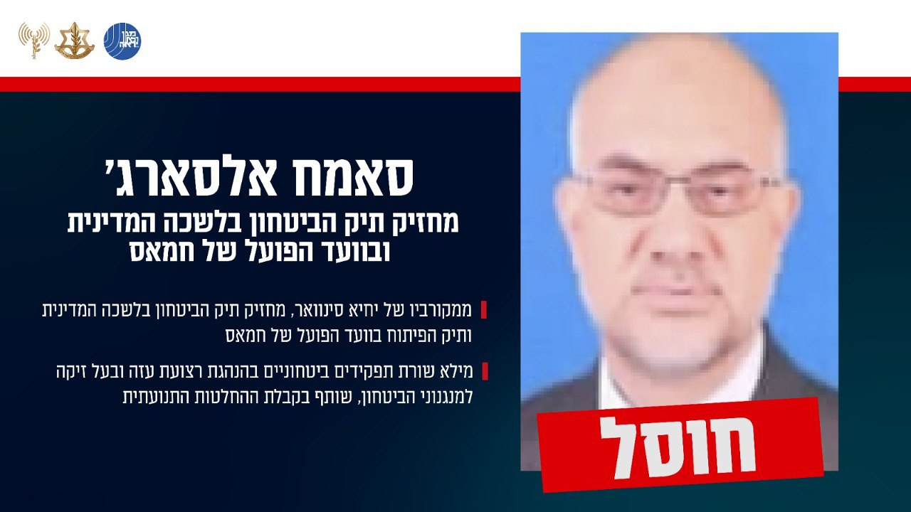

## Message 12103

הודעה משותפת לדובר צה"ל ודוברות שב"כ:

צה"ל ושב"כ חיסלו את רוחי משתהא, ראש שלטון חמאס ברצועת עזה

דובר צה"ל ודוברות שב"כ מודיעים כי כעת ניתן לאשר שבתקיפה משותפת של צה"ל ושב"כ לפני כשלושה חודשים בעזה, חוסל המחבל רוחי משתהא, אשר שימש כראש שלטון חמאס ברצועת עזה, יחד עם המחבל סאמח אלסארג' שהחזיק בתיק הביטחון בלשכה המדינית ובוועד הפועל של חמאס והמחבל סאמי עודה, מפקד מנגנון הבטחון הכללי של חמאס. 

מטוסי קרב של חיל האוויר תקפו, בהכוונה מודיענית מדויקת של אגף המודיעין ושב"כ, את המחבלים שהסתתרו במתחם תת-קרקעי מבוטן ומצויד בצפון רצועת עזה, המאפשר שהיית בכירים ופיקוד ושליטה על הארגון לאורך זמן. המתחם נוהל על ידי בכירי מנגנון הביטחון הכללי של חמאס ושימש כמתחם שהייה של צמרת שלטון החמאס ובראשם משתהא.

לאחר תקיפת המתחם וחיסול המחבלים, ארגון הטרור חמאס לא פרסם את דבר חיסולם וזאת על מנת למנוע פגיעה מוראלית ותפקודית בפעילי הארגון, כפי שנהג בחיסולים אחרים.

