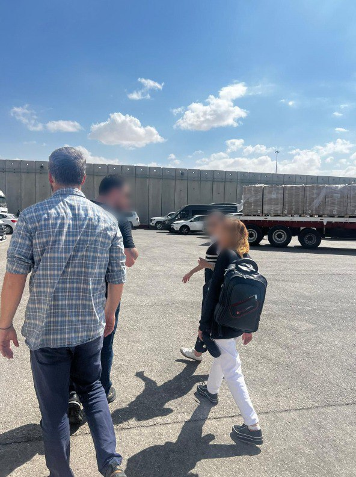

## Message 12121

דובר צה"ל:

לאחר למעלה מעשור בעזה: צה"ל, בהובלת המתפ"ש, בשיתוף עם השגרירות האמריקאית בישראל, פעלו לשחרור צעירה יזידית שהוחזקה ע"י פעיל חמאס מזוהה דאעש ברצועה 

בפעילות שתואמה על ידי צה"ל בהובלת המתפ"ש עם השגרירות האמריקאית בישראל וגורמים נוספים בקהילה הבינלאומית, פאוזיה אמין סידו - צעירה כבת 21 ממוצא יזידי, שוחררה השבוע חזרה לביתה בעיראק. לפני כעשור, כשהיתה בת 11 בלבד, אנשי "המדינה האיסלאמית" (דאעש) סחרו בה לפעיל חמאס מזוהה דאעש ברצועת עזה. 

במהלך מלחמת "חרבות ברזל", המחבל שהחזיק בה נהרג, ככל הנראה במהלך תקיפות של צה"ל ברצועה, והיא נמלטה למקום מסתור ברצועה. בתום הליכי תיאום מורכבים בין ישראל, ארצות הברית  וגורמים נוספים בקהילה הבינלאומית - הצעירה הוצאה בימים האחרונים במבצע חשאי מרצועת עזה דרך מעבר כרם שלום. עם יציאתה לישראל, הצעירה המשיכה לירדן דרך מעבר גשר אלנבי - ומשם חזרה למשפחתה בעיראק. 

זוהי עדות נוספת לקשר בין ארגון הטרור חמאס ל"מדינה האיסלאמית" (דאעש) והוכחה נוספת לפשעים נגד האנושות שמבצע ארגון הטרור הרצחני ברצועת עזה.

