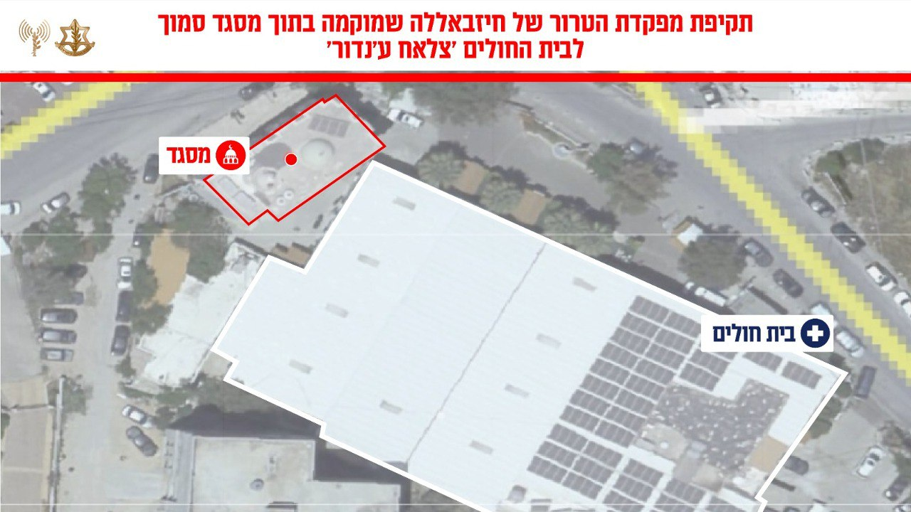

## Message 12163

דובר צה"ל:

כלי טיס של חיל האוויר תקפו במהלך הלילה, באופן ממוקד ובהכוונה מודיעינית של אמ"ן ופיקוד הצפון, פעילים של ארגון הטרור חיזבאללה שפעלו במפקדה שהוקמה במסגד סמוך לבית חולים "צלאח ע'נדור" שבדרום לבנון.

המפקדה שימשה את המחבלים לתכנון והוצאה לפועל של פעולות טרור נגד כוחות צה"ל ומדינת ישראל.

טרם התקיפה, נשלחו הודעות לתושבים והתקיימו שיחות עם גורמים מרכזיים בכפרים שבהם נמצאים בתי החולים בהם צה"ל זיהה כי ארגון הטרור חיזבאללה עושה שימוש אסור בהתאם לחוקי המלחמה, בדרישה כי כל פעולות הטרור המתבצעות בבית החולים יחדלו לאלתר.

מאז תחילת המלחמה, וביתר שאת מתחילת הפעילות הקרקעית המוגבלת בדרום לבנון, צה"ל עושה מאמצים רבים למניעת פגיעה בבלתי מעורבים ובתשתיות אזרחיות, וזאת לעומת השימוש השיטתי של ארגון הטרור חיזבאללה בתשתיות אזרחיות, כולל מבנים חיוניים לביצוע פעילות טרור. צה"ל ימשיך לפעול ולהגן על אזרחי מדינת ישראל.

