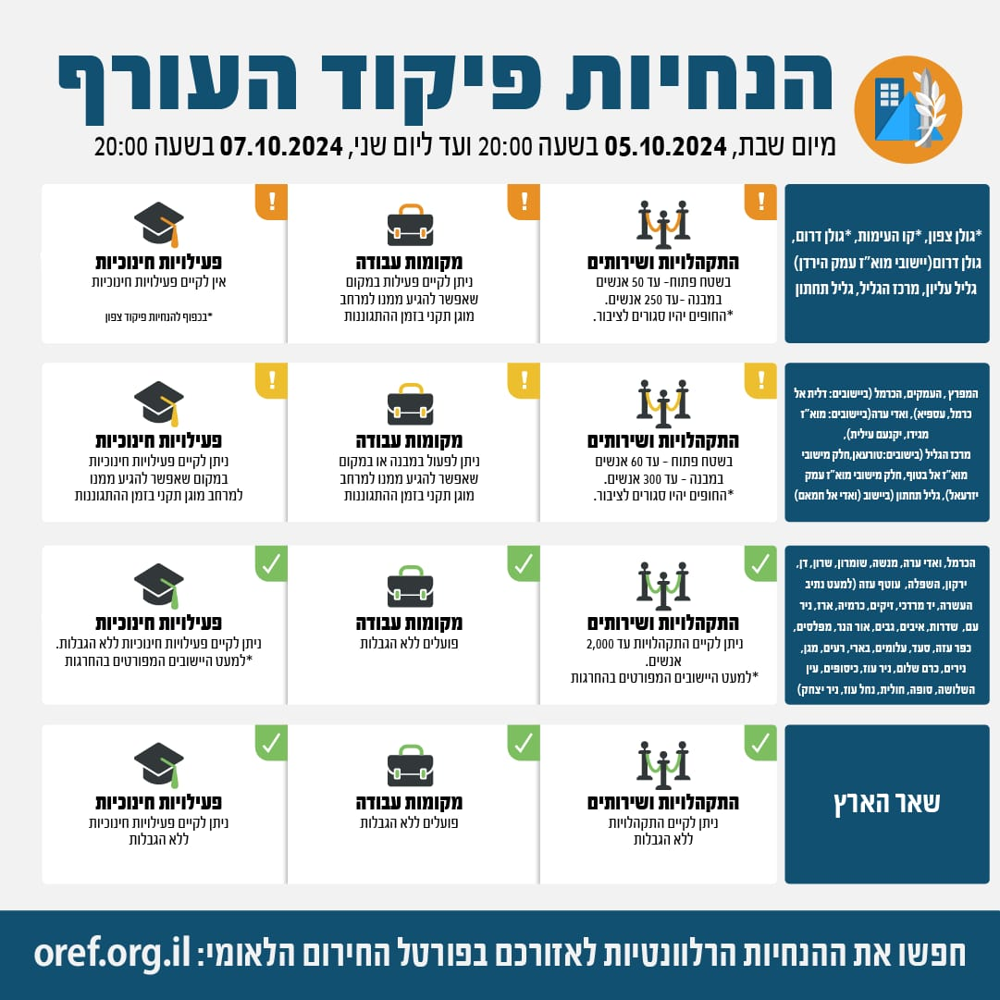

## Message 12182

דובר צה"ל:

שינויים במדיניות ההתגוננות של פיקוד העורף

בתום הערכת מצב, הוחלט כי החל מהיום (ש') בשעה 20:00, יתעדכנו הנחיות ההתגוננות של פיקוד העורף 
באזורי ההנחיה הכרמל, ואדי ערה, מנשה, שומרון, שרון, דן ירקון, השפלה וחלק מיישובי עוטף עזה – ניתן יהיה לקיים התקהלויות עד 2,000 אנשים (במקום 1,000 במרבית האזורים עד כה) בהתאם להנחיות פיקוד העורף.

כמו כן, הועברו למדרג פעילות חלקית היישובים הבאים: באזור הנחייה מרכז הגליל (טורעאן, חלק מיישובי מוא"ז אל-בטוף וחלק מיישובי מוא"ז עמק יזרעאל) ובאזור הנחייה גליל תחתון ביישוב ואדי אל חמאם.

שאר אזורי הארץ נותרו ללא שינוי בהנחיות שניתנו עד כה.

יש להמשיך ולעקוב אחר ההנחיות המפורסמות על ידי פיקוד העורף באמצעי ההפצה הרשמיים. 
ההנחיות המלאות מעודכנות בפורטל החירום הלאומי וביישומון פיקוד העורף.

