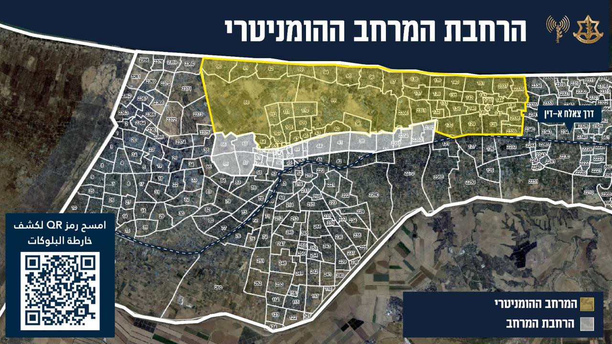

## Message 12192

דובר צה״ל:

צה״ל מרחיב את האזור ההומניטרי במוואסי ומעדכן את נתיבי הפינוי מצפון הרצועה

צה״ל מודיע הבוקר על הרחבת האזור ההומניטרי במוואסי. האזור ההומניטרי המורחב כולל בתי חולים שדה שהוקמו החל מפרוץ המלחמה, מתחמי אוהלים ואספקה של מזון, מים, תרופות וציוד רפואי.

לצורך כך, נפתחו מחדש שני נתיבי פינוי הומניטריים מצפון הרצועה: האחד בכביש צלאח אלדין והשני בכביש אל-רשיד (הים). 

כמו כן, צה״ל פרסם לאוכלוסיה הפלסטינית מפות על אזורי פינוי פוטנציאליים בצפון הרצועה, שכוללים ״מרחבי בלוקים״ על פי שכונות ואזורים. 

צה״ל ימשיך לפעול למימוש מטרות המלחמה ובהן פירוק החמאס והשבת כלל החטופים.

