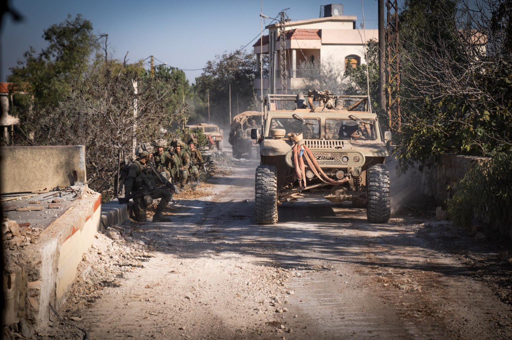

## Message 12206

דובר צה״ל:

צה"ל ממשיך בפעילות הממוקדת בדרום לבנון: כוחות אוגדה 36 ו-98 איתרו והשמידו אתרי שיגור, פירי מנהרות, מבנים צבאיים ואמצעי לחימה, חיל האוויר תקף יותר מ-150 מטרות טרור בהכוונת הכוחות הקרקעיים

כוחות אוגדה 36 ממשיכים לפעול בדרום לבנון, לחסל מחבלים ולהשמיד תשתיות טרור של ארגון הטרור החיזבאללה. 
במהלך היממה האחרונה, כוחות חטיבת גולני איתרו והשמידו פירים, מחסני אמצעי לחימה, בורות תחמושת ומרחבי הערכות של מחבלי ארגון הטרור חיזבאללה.
בסגירת מעגל, כלי טיס של חיל האוויר יחד עם כוחות 282 תקפו מחבלים חמושים שהיוו איום לאחר שזוהו על ידי הכוח.

במהלך היממה האחרונה, כוחות אוגדה 98 חיסלו מחבלים בהיתקלויות פנים אל פנים ובשיתוף חיל האוויר.
הכוחות יצאו לפשיטות ואיתרו אמצעי לחימה ומרכזי לחימה של ארגון הטרור חיזבאללה.
בתקיפות אוויריות שהוכוונו על ידי הכוחות, כלי טיס ומטוסי קרב של חיל האוויר תקפו מתחמים צבאיים של ארגון הטרור חיזבאללה, מחסני אמצעי לחימה ועמדות מחבלים מאוישות. כתוצאה מהתקיפות חוסלו  מחבלי חיזבאללה, בהם מחבלים מכוח רדואן.

