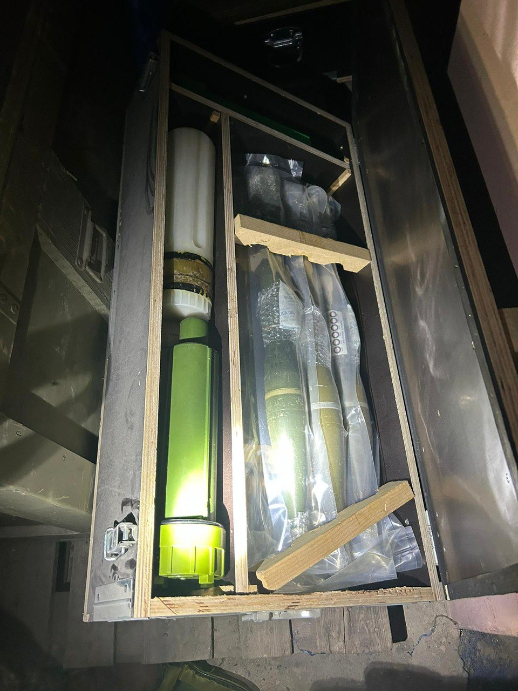

## Message 12214

דובר צה"ל:

במהלך פעילות חטיבת הצנחנים בדרום לבנון: אותרו רכבים חמושים ואמצעי לחימה של ׳כוח רדואן׳ מוכנים לפעולות טרור

צוות הקרב של חטיבת הצנחנים ממשיך בפעילות בדרום לבנון, בפשיטות על מתחמי הלחימה של ארגון הטרור חיזבאללה. במבנים אזרחיים בהם עושה שימוש חיזבאללה, אותרו מאות אמצעי לחימה ובהם רכב מצוייד באמצעי לחימה של ׳כוח רדואן׳ אשר ייעודו לשמש את המחבלים לפיגועי טרור.

בנוסף, אותרו במרחב משגרים, מרגמות, מוקשים, מטענים, חומרי נפץ, טיל נ״ט, רימונים ועוד. אמצעי הלחימה נלקחו ויועברו לשטח הארץ. 

הכוחות ממשיכים בלחימה נגד חיזבאללה בכפר שנחשב למעוז חיזבאללה בדרום לבנון ממנו הוצאו מתווי טרור רבים נגד יישובי אצבע הגליל. הלוחמים מחסלים מחבלים רבים בקרבות פנים אל פנים ומהאוויר.

