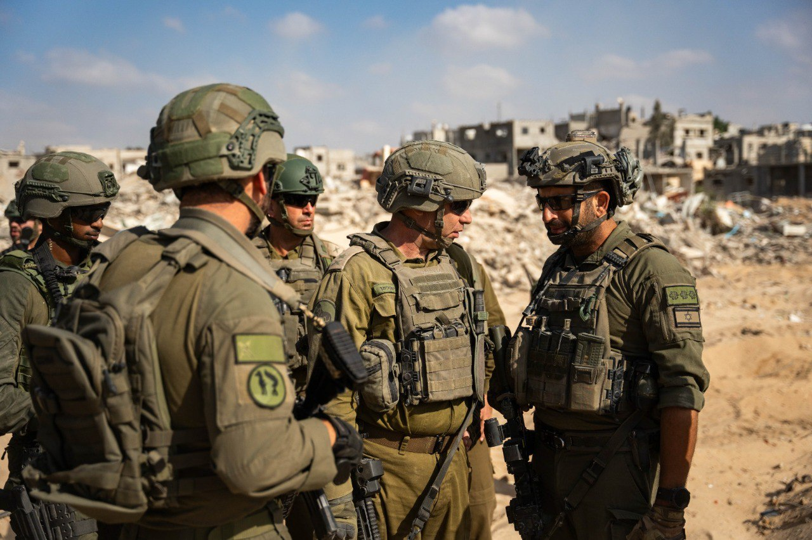

## Message 12233

דובר צה"ל:

כוחות אוגדה 162 פועלים במרחב ג'באליה במהלך היממה האחרונה

ביממה האחרונה צוותי הקרב החטיבתיים של חטיבות 401 ו-460 פועלים במרחב ג'באליה.

בשעות שקדמו לתחילת הפעילות ובמהלכה, חיל האוויר תקף עשרות מטרות טרור בהכוונת חטיבת האש 215: מחבלי נוחב'ה, תשתיות תת קרקע, תשתיות טרור רבות ועוד.

במהלך היום לוחמי אוגדה 162 איתרו אמצעי לחימה רבים במרחב, בהם רימונים, תחמושת, מטענים ונתקלו בחוליות מחבלים.
באחת ההתקלויות כוחות צוות הקרב של חטיבה 401 נתקלו בשני מחבלים במבנה ולאחר חילופי אש חוסלו שני המחבלים באמצעות ירי טנק.
הכוחות ממשיכים כעת לפעול במרחב, למול תשתיות טרור ומחבלים כחלק מההתקפה.

כלי טיס של חיל האוויר בשיתוף פיקוד הדרום, תקף מוקדם יותר היום את אתר השיגור ממנו שוגרו הרקטות היום לעבר מרחב אשקלון.

