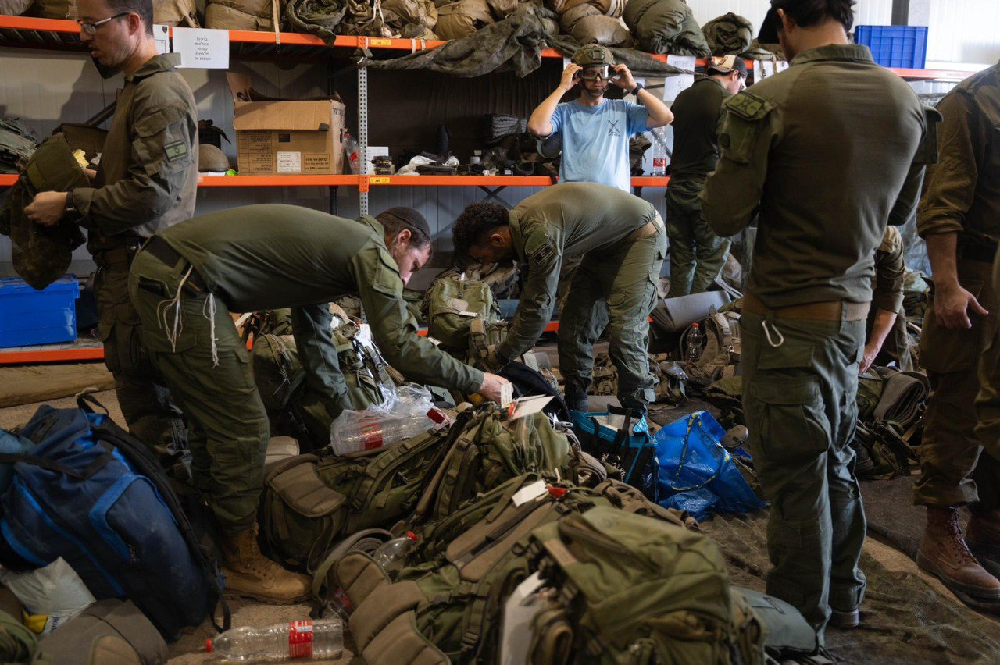

## Message 12246

דובר צה"ל:

עוצבת ׳הגליל׳ (91) החלה אמש (א') בפעילות קרקעית ממוקדת ומתוחמת בדרום ללבנון

כוחות עוצבת ׳הגליל׳ (91) ובהם לוחמי חטיבות המילואים אלכסנדרוני (3), ‘הזקן’ (8) והנח״ל הצפונית (228) החלו בפעילות קרקעית ממוקדת ומתוחמת בדרום ללבנון.

לאחר לחימה של כמעט שנה בגזרה הצפונית וברצועת עזה, גויסו מחדש בשבועיים האחרונים לוחמי המילואים, ביצעו נוהל קרב, התאמנו והעלו כשירות. 

מתחילת המלחמה מנהלת עוצבת ׳הגליל׳ (91) קרב הגנה משולב בפעולות התקפיות רבות לפגיעה באויב ותשתיותיו בדרום לבנון מהאוויר ומהקרקע. בשבועות האחרונים, כוחות האוגדה ביצעו מאות תקיפות וחיסלו עשרות מחבלים.

במקביל לפעילות הקרקעית, חטיבה 769 ממשיכה במשימת ההגנה.

