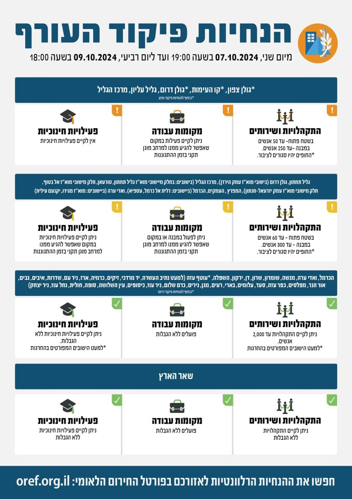

## Message 12275

דובר צה״ל:

שינויים במדיניות ההתגוננות של פיקוד העורף

בתום הערכת מצב, הוחלט כי היום (ב') בשעה 19:00, יתעדכנו הנחיות ההתגוננות של פיקוד העורף. במסגרת השינויים אזור הנחייה גליל תחתון, אזור הנחייה גולן דרום (ביישובי מוא"ז עמק הירדן) ואזור הנחיה מרכז הגליל (בחלק מיישובי מוא"ז גליל תחתון) יעברו ממדרג פעילות מצומצמת למדרג פעילות חלקית, המאפשר קיום פעילויות חינוכיות במקום המאפשר להגיע ממנו למרחב מוגן תקני בזמן ההתגוננות.

יש להמשיך ולעקוב אחר ההנחיות המפורסמות על ידי פיקוד העורף באמצעי ההפצה הרשמיים. 
ההנחיות המלאות מעודכנות בפורטל החירום הלאומי וביישומון פיקוד העורף.

